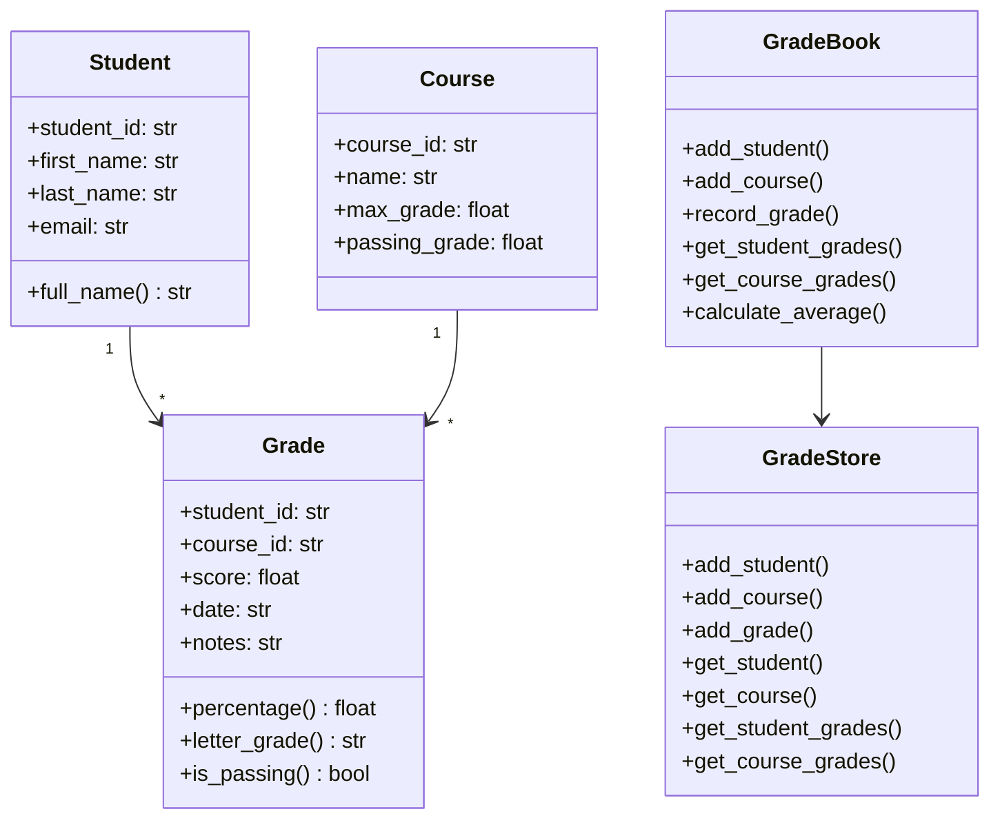
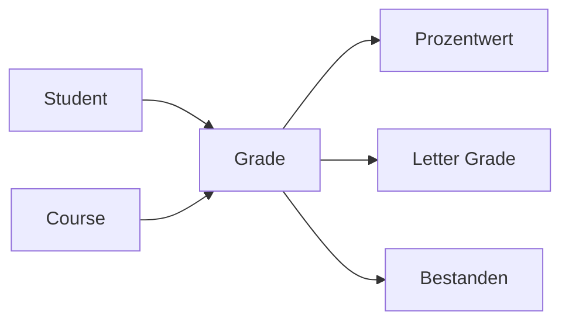
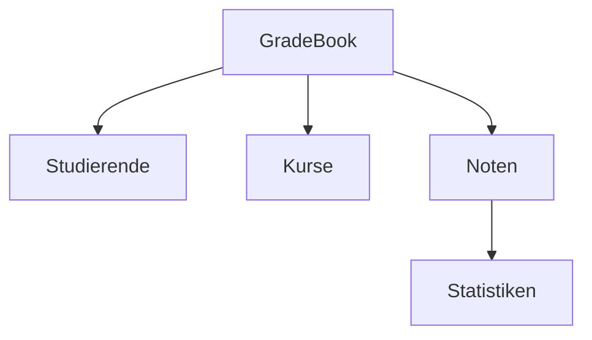
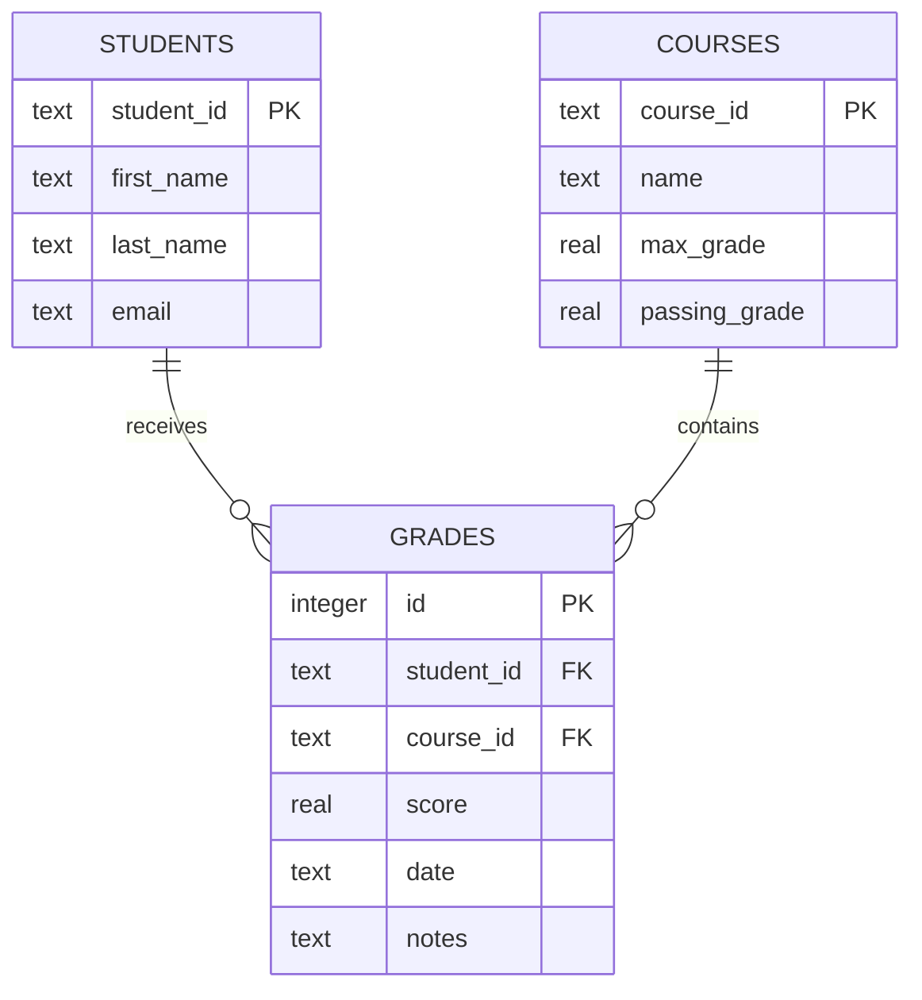
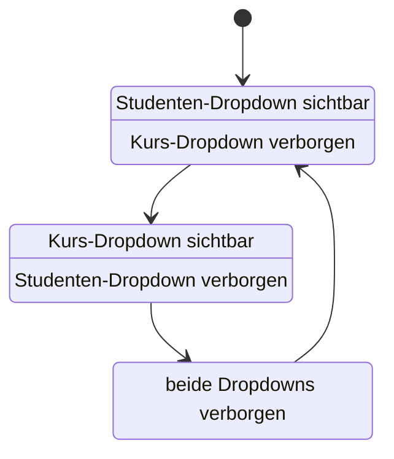
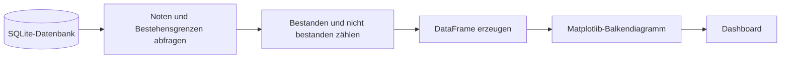
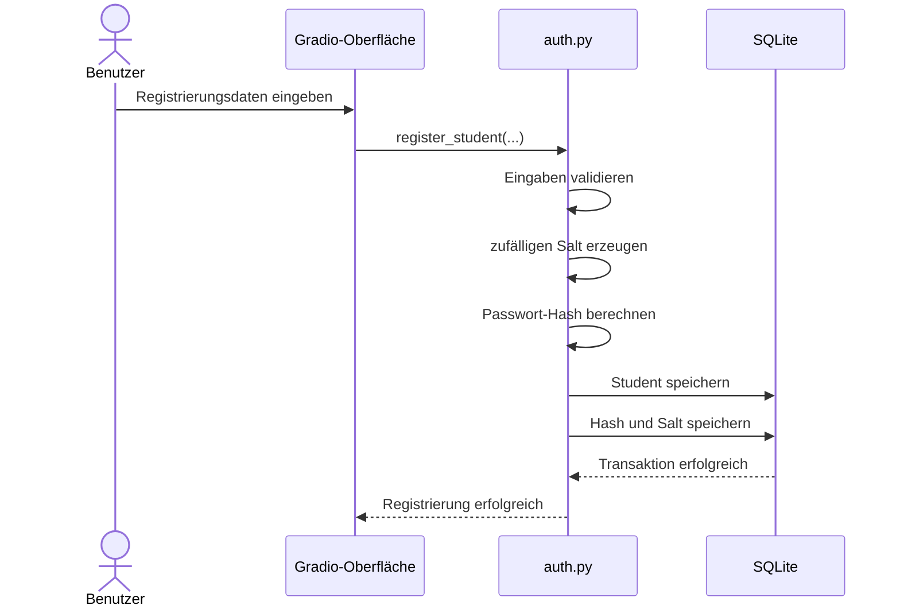
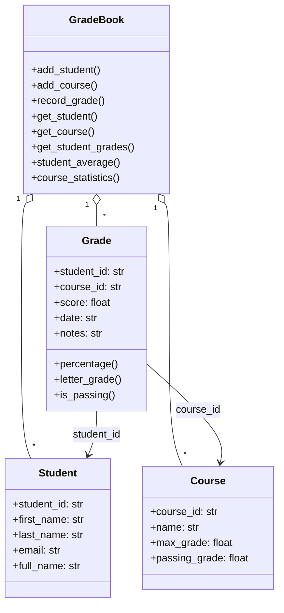
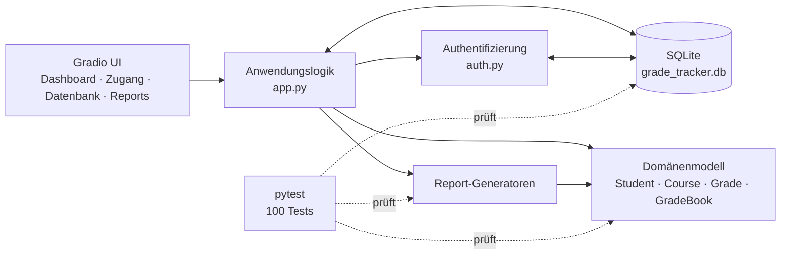

# Projektbeschreibung – Student Grade Tracker

## 1. Überblick

Der **Student Grade Tracker** ist eine in Python entwickelte Anwendung zur Verwaltung und Auswertung von Studierenden, Kursen und Noten.

Die Anwendung verbindet eine objektorientierte Programmlogik mit einer SQLite-Datenbank und einer browserbasierten Benutzeroberfläche auf Basis von Gradio. Neben klassischen Verwaltungsfunktionen stehen Berichte, Dashboard-Kennzahlen, Diagramme und CSV-Exporte zur Verfügung.

Das Projekt wurde schrittweise in mehreren Entwicklungsphasen umgesetzt. Jede Phase erweitert die vorherige um zusätzliche technische und fachliche Funktionen.

---

## 2. Projektziele

Das Projekt verfolgt folgende Ziele:

- objektorientierte Modellierung einer Notenverwaltung
- strukturierte Speicherung in einer SQLite-Datenbank
- Trennung von Fachlogik, Persistenz und Benutzeroberfläche
- automatisierte Berechnung von Durchschnitt und Bestehensstatus
- Erstellung unterschiedlicher Berichte
- übersichtliche Darstellung wichtiger Kennzahlen
- CSV-Export ausgewählter Datenbanktabellen
- Registrierung und Anmeldung von Studierenden
- automatisierte Tests zur Qualitätssicherung
- nachvollziehbare Versionsverwaltung mit Git und GitHub

---

## 3. Hauptfunktionen

### Verwaltung von Studierenden

Studierende werden mit folgenden Eigenschaften verwaltet:

- Student-ID
- Vorname
- Nachname
- E-Mail-Adresse

Zusätzlich können neue Studierende über die Gradio-Oberfläche registriert werden.

### Verwaltung von Kursen

Kurse besitzen:

- Kurs-ID
- Kursname
- maximale Punktzahl
- Bestehensgrenze

### Verwaltung von Noten

Eine Note verbindet einen Studierenden mit einem Kurs. Gespeichert werden:

- Student-ID
- Kurs-ID
- erreichte Punktzahl
- Datum
- optionale Bemerkung

### Berichte

Die Anwendung erzeugt:

- Student Report
- Course Report
- Summary Report

Die passenden Auswahlfelder werden abhängig vom ausgewählten Reporttyp angezeigt.

### Dashboard

Das Dashboard liest seine Kennzahlen direkt aus SQLite:

- Anzahl der Studierenden
- Anzahl der Kurse
- Anzahl der erfassten Noten
- Gesamtdurchschnitt
- Bestehensquote

Zusätzlich zeigt ein Balkendiagramm die Anzahl bestandener und nicht bestandener Noten.

### SQLite-Ansicht und CSV-Export

Die Tabellen `students`, `courses` und `grades` können in der Oberfläche angezeigt und als CSV-Dateien exportiert werden.

### Studentenzugang

Die Anwendung enthält eine einfache Registrierung und Anmeldung. Passwörter werden nicht im Klartext gespeichert, sondern als Hashwerte in SQLite abgelegt.

---

## 4. Technische Architektur

Die Anwendung verwendet eine mehrschichtige Struktur:

```text
Gradio-Benutzeroberfläche
          │
          ▼
Anwendungs- und Reportlogik
          │
          ▼
GradeBook und GradeStore
          │
          ▼
SQLite-Datenbank
```

### Zentrale Module

| Modul | Aufgabe |
|---|---|
| `student.py` | Modell eines Studierenden |
| `course.py` | Modell eines Kurses |
| `grade.py` | Modell und Auswertung einer Note |
| `gradebook.py` | zentrale Fachlogik |
| `grade_store.py` | Speicherabstraktion und CRUD-Funktionen |
| `database.py` | Aufbau und Initialisierung von SQLite |
| `reports/` | Text- und CSV-Berichte |
| `auth.py` | Registrierung, Passwort-Hashing und Anmeldung |
| `app.py` | Gradio-Oberfläche und Benutzerinteraktion |
| `exceptions.py` | projektspezifische Ausnahmen |

### Vereinfachtes Klassendiagramm



---

## 5. Entwicklungsphasen

### Phase 1 – Domänenmodell und Grundlagen

In der ersten Phase wurden die zentralen Klassen entwickelt:

- `Student`
- `Course`
- `Grade`

Der Schwerpunkt lag auf objektorientierter Modellierung, Validierung und grundlegenden Berechnungen.



### Phase 2 – GradeBook und zentrale Fachlogik

Die Klasse `GradeBook` bündelt die fachlichen Funktionen:

- Studierende hinzufügen
- Kurse hinzufügen
- Noten erfassen
- Noten suchen
- Durchschnittswerte berechnen
- Bestehensquoten ermitteln



### Phase 3 – Persistenz und SQLite

In dieser Phase wurde die dauerhafte Speicherung ergänzt.

Die SQLite-Datenbank enthält die Tabellen:

- `students`
- `courses`
- `grades`

Die Beziehungen werden durch Fremdschlüssel abgebildet.



## Phase 4 – SQLite-Persistenz

Die bisherige dateibasierte Speicherung wurde durch eine relationale SQLite-Datenbank ergänzt. Studierende, Kurse und Noten werden in getrennten Tabellen gespeichert.

Fremdschlüssel bilden die fachlichen Beziehungen ab:

* Eine Note gehört zu genau einem Studierenden.
* Eine Note gehört zu genau einem Kurs.
* Ein Studierender kann mehrere Noten besitzen.
* Ein Kurs kann mehrere Noten enthalten.

Die Anwendung verwendet die lokale Datenbankdatei `grade_tracker.db`. Die Datenbank selbst wird nicht im Repository versioniert, da sie lokale Anwendungs- und Zugangsdaten enthalten kann.

```mermaid
erDiagram
    STUDENTS ||--o{ GRADES : receives
    COURSES ||--o{ GRADES : contains
    STUDENTS ||--o| STUDENT_ACCOUNTS : owns

    STUDENTS {
        text student_id PK
        text first_name
        text last_name
        text email
    }

    COURSES {
        text course_id PK
        text name
        real max_grade
        real passing_grade
    }

    GRADES {
        integer id PK
        text student_id FK
        text course_id FK
        real score
        text date
        text notes
    }

    STUDENT_ACCOUNTS {
        text student_id PK_FK
        text password_hash
        text salt
    }
```

Zusätzlich bietet die Gradio-Oberfläche einen SQLite-Tab. Dort können die freigegebenen Tabellen `students`, `courses` und `grades` angezeigt werden.

Eine Whitelist verhindert, dass beliebige Tabellennamen an eine SQL-Abfrage übergeben werden.

**Ergebnis:** Die Anwendung verfügt über eine dauerhafte relationale Datenspeicherung mit nachvollziehbaren Beziehungen zwischen Studierenden, Kursen und Noten.

---

## Phase 5 – Reports und Gradio-Oberfläche

In Phase 5 wurde die Kernanwendung um eine grafische Benutzeroberfläche mit Gradio erweitert.

Die Oberfläche enthält mehrere Bereiche:

* Dashboard
* Studentenzugang
* SQLite-Datenbank
* Reports

Der Reportbereich stellt drei Berichtsarten bereit:

### Student Report

Der Student Report zeigt:

* Name des Studierenden
* Student-ID
* E-Mail-Adresse
* belegte beziehungsweise bewertete Kurse
* erreichte Punktzahl
* prozentuales Ergebnis
* Buchstabennote
* Bestehensstatus
* persönlichen Durchschnitt

### Course Report

Der Course Report zeigt:

* Kursname
* Kurs-ID
* vorhandene Noten
* zugehörige Studierende
* Kursdurchschnitt
* Bestehensquote

### Summary Report

Der Summary Report fasst das gesamte Notenbuch zusammen:

* Anzahl der Studierenden
* Anzahl der Kurse
* Anzahl der Noten
* Kursstatistiken
* Durchschnittswerte
* Bestehensquoten

Für Student Reports und Course Reports wurden getrennte Dropdown-Menüs erstellt. Dadurch muss der Benutzer keine IDs manuell eingeben.

Die Oberfläche reagiert dynamisch auf den ausgewählten Reporttyp:



Neu registrierte Studierende werden aus der SQLite-Datenbank geladen und nach dem Aktualisieren beziehungsweise Neustarten der Anwendung in der Auswahl angezeigt.

**Ergebnis:** Berichte können über eine verständliche grafische Oberfläche ausgewählt und erzeugt werden.

---

## Phase 6 – Dashboard, Export und Benutzerzugang

Phase 6 erweitert die Anwendung um Funktionen, die über die reine Notenverwaltung hinausgehen.

### Dashboard

Das Dashboard liest seine Kennzahlen direkt aus der SQLite-Datenbank.

Angezeigt werden:

* Anzahl der Studierenden
* Anzahl der Kurse
* Anzahl der erfassten Noten
* Gesamtdurchschnitt
* Bestehensquote

Dadurch entsprechen die angezeigten Werte dem aktuellen Datenbestand und nicht mehr fest eingetragenen Demo-Werten.

### Bestehensdiagramm

Die Anwendung erzeugt mit Matplotlib ein Balkendiagramm. Es stellt bestandene und nicht bestandene Noten gegenüber.



Das Diagramm wird automatisch aus den in SQLite gespeicherten Noten berechnet.

### CSV-Export

Im SQLite-Tab kann die ausgewählte Tabelle als CSV-Datei exportiert werden.

Der Ablauf ist:

1. Tabelle auswählen.
2. Tabelleninhalt laden.
3. „Als CSV exportieren“ anklicken.
4. Erzeugte Datei herunterladen.

Auch beim Export dürfen ausschließlich freigegebene Tabellen verwendet werden.

### Studentenregistrierung und Anmeldung

Der Tab „Zugang“ enthält zwei Bereiche:

* Anmeldung eines vorhandenen Studierenden
* Registrierung eines neuen Studierenden

Bei der Registrierung werden folgende Angaben erfasst:

* Student-ID
* Vorname
* Nachname
* E-Mail-Adresse
* Passwort
* Passwortwiederholung

Das Passwort wird nicht im Klartext gespeichert. Stattdessen wird ein zufälliger Salt erzeugt und gemeinsam mit dem Passwort zur Berechnung eines Passwort-Hashs verwendet.



Bei der Anmeldung wird das eingegebene Passwort mit dem gespeicherten Salt erneut gehasht. Anschließend wird der berechnete Hash mit dem gespeicherten Wert verglichen.

**Ergebnis:** Die Anwendung besitzt ein datenbankgestütztes Dashboard, einen CSV-Export und eine grundlegende sichere Studentenregistrierung.

---

# Domain Model

Das Domain Model beschreibt die fachlichen Kernobjekte der Anwendung. Es ist unabhängig von Gradio und SQLite aufgebaut.



## Verantwortlichkeiten der Klassen

### Student

Die Klasse `Student` repräsentiert einen Studierenden. Sie speichert die Student-ID, den Vor- und Nachnamen sowie die E-Mail-Adresse.

### Course

Die Klasse `Course` repräsentiert einen Kurs. Neben Kurs-ID und Kursname enthält sie die maximale Punktzahl und die erforderliche Bestehensgrenze.

### Grade

Die Klasse `Grade` verbindet einen Studierenden mit einem Kurs und einem erreichten Ergebnis. Sie berechnet:

* prozentuales Ergebnis
* Buchstabennote
* Bestehensstatus

### GradeBook

`GradeBook` dient als zentrale fachliche Verwaltung. Es koordiniert Studierende, Kurse und Noten und stellt Such- und Statistikfunktionen bereit.

**Architekturentscheidung:** Fachliche Berechnungen gehören in das Domain Model. Die Benutzeroberfläche soll diese Funktionen lediglich aufrufen und Ergebnisse darstellen.

---

# Tests und Qualitätssicherung

Die Anwendung besitzt automatisierte Tests für:

* Studierende
* Kurse
* Noten
* GradeBook
* Validierung
* Exceptions
* Datenbankoperationen
* Persistenz
* Reports
* Integrationsabläufe

Die Tests werden mit folgendem Befehl ausgeführt:

```bash
uv run pytest -q
```

Der zuletzt dokumentierte Testlauf ergab:

```text
100 passed
```

Die Tests prüfen sowohl reguläre Abläufe als auch Fehlerfälle, beispielsweise:

* doppelte Student-IDs
* unbekannte Studierende
* unbekannte Kurse
* ungültige Punktzahlen
* beschädigte oder unvollständige Daten
* leere Pflichtfelder

---

# Bekannte Grenzen

Die Anwendung ist ein Lern- und Demonstrationsprojekt. Folgende Punkte können zukünftig verbessert werden:

* automatische Aktualisierung der Dropdowns ohne App-Neustart
* vollständige Sitzungsverwaltung nach der Anmeldung
* Rollen und Berechtigungen für Studierende und Lehrkräfte
* Zurücksetzen vergessener Passwörter
* Änderungs- und Löschfunktionen in der Oberfläche
* stärkere Trennung zwischen UI, Anwendungslogik und Datenbankzugriffen
* zusätzliche Diagramme und Filter
* Deployment auf einem Server
* umfassendere Tests für Authentifizierung und Gradio-Ereignisse

---

# Fazit

Der Student Grade Tracker entwickelte sich schrittweise von einem objektorientierten Konsolenprojekt zu einer grafischen, datenbankgestützten Anwendung.

Das Projekt demonstriert:

* objektorientierte Modellierung
* Validierung und Fehlerbehandlung
* Datei- und SQLite-Persistenz
* automatisierte Tests
* Reportgenerierung
* grafische Oberflächenentwicklung mit Gradio
* Datenvisualisierung mit Matplotlib
* CSV-Export
* sichere Passwortspeicherung durch Salt und Hash
* strukturierte, phasenweise Softwareentwicklung

Die Kernfunktionalität ist umgesetzt. Weitere Arbeiten betreffen hauptsächlich Feinschliff, zusätzliche Tests, Dokumentation und mögliche Komfortfunktionen.


# Student Grade Tracker

[](https://www.python.org/)
[](https://www.gradio.app/)
[](https://www.sqlite.org/)
[](#tests)

Der **Student Grade Tracker** ist eine in Python entwickelte Anwendung zur Verwaltung und Auswertung von Studierenden, Kursen und Noten. Das Projekt verbindet objektorientierte Programmierung, eine SQLite-Persistenzschicht, automatisierte Tests, Textberichte und eine interaktive Gradio-Oberfläche.

Die Anwendung entstand schrittweise in sechs Entwicklungsphasen. Dadurch sind Domänenlogik, Speicherung, Berichte und Benutzeroberfläche klar voneinander getrennt und nachvollziehbar dokumentiert.

## Funktionsumfang

- Studierende und Kurse verwalten
- Noten erfassen, validieren und statistisch auswerten
- Daten dauerhaft in SQLite speichern
- Student-, Kurs- und Gesamtberichte erzeugen
- Dashboard-Kennzahlen direkt aus der Datenbank laden
- Bestehensverteilung als Balkendiagramm darstellen
- Datenbanktabellen anzeigen und als CSV exportieren
- Studierende registrieren und anmelden
- Passwörter ausschließlich als gesalzene PBKDF2-Hashes speichern
- Report-Auswahl dynamisch an den gewählten Berichtstyp anpassen
- Kernlogik mit 100 automatisierten Tests absichern

## Anwendung

Die Gradio-Oberfläche besteht aus vier Bereichen:

| Bereich | Zweck |
|---|---|
| **Dashboard** | Zeigt Anzahl der Studierenden, Kurse und Noten sowie Durchschnitt, Bestehensquote und Diagramm. |
| **Zugang** | Ermöglicht Registrierung und Anmeldung von Studierenden. |
| **SQLite-Datenbank** | Zeigt freigegebene Tabellen und stellt sie als CSV-Datei bereit. |
| **Reports** | Erzeugt Student-, Kurs- und Gesamtberichte mit kontextabhängigen Dropdowns. |

## Architektur



## Entwicklungsphasen

| Phase | Schwerpunkt | Ergebnis |
|---|---|---|
| **1 – Domänenmodell** | OOP-Grundstruktur | Klassen für Studierende, Kurse, Noten und Notenbuch |
| **2 – Geschäftslogik** | Validierung und Berechnungen | Durchschnitte, Bestehensstatus, Suche und Fehlerfälle |
| **3 – Dateien und Fehlerbehandlung** | JSON/CSV und eigene Exceptions | Import, Export und robuste Fehlermeldungen |
| **4 – SQLite-Persistenz** | Relationale Speicherung | Tabellen, Fremdschlüssel und persistentes `GradeStore` |
| **5 – Reports und GUI** | Auswertung und Gradio | Student-, Kurs- und Gesamtberichte in einer Weboberfläche |
| **6 – Dashboard und Abschluss** | Visualisierung, Zugang und UX | Dashboard, Diagramm, CSV-Download, Registrierung, dynamische UI und Abschlusstests |

Die ausführliche Entwicklungsgeschichte mit einem UML- beziehungsweise Architekturdiagramm pro Phase befindet sich in der [Projektbeschreibung](docs/project_description.md).

## Schnellstart

### Voraussetzungen

- Python 3.13 oder neuer
- [uv](https://docs.astral.sh/uv/)
- Git

### Installation

```bash
git clone https://github.com/degenhardtmuc-ui/student_grade_tracker.git
cd student_grade_tracker
uv sync
```

### Anwendung starten

```bash
uv run python -m notenverwaltung.app
```

Gradio zeigt anschließend eine lokale Adresse an, üblicherweise:

```text
http://127.0.0.1:7860
```

## Tests

```bash
uv run pytest -q
```

Aktueller Projektstand: **100 Tests erfolgreich**.

Die Tests decken unter anderem Domänenklassen, Validierung, Exceptions, Persistenz, SQLite-Integration, Reports und Setup ab.

## Projektstruktur

```text
student_grade_tracker/
├── notenverwaltung/
│   ├── app.py
│   ├── auth.py
│   ├── course.py
│   ├── database.py
│   ├── exceptions.py
│   ├── grade.py
│   ├── grade_store.py
│   ├── gradebook.py
│   ├── student.py
│   └── reports/
│       ├── base.py
│       ├── csv_report.py
│       └── text_report.py
├── tests/
├── docs/
│   └── project_description.md
├── pyproject.toml
├── uv.lock
└── README.md
```

## Datenbank und Sicherheit

Die lokale Datei `grade_tracker.db` wird beim Betrieb der Anwendung verwendet, aber durch `.gitignore` nicht in Git versioniert. Damit bleiben lokale Benutzerkonten und Testdaten außerhalb des öffentlichen Repositorys.

Bei der Registrierung wird kein Klartextpasswort gespeichert. `auth.py` verwendet:

- einen zufälligen Salt pro Konto,
- PBKDF2-HMAC mit SHA-256,
- 200.000 Iterationen,
- einen konstantzeitlichen Hashvergleich bei der Anmeldung.

Die aktuelle Zugangsfunktion prüft Anmeldedaten. Eine rollenbasierte Zugriffskontrolle und serverseitige Sitzungsverwaltung sind mögliche spätere Erweiterungen.

## Bekannte Grenzen

- Dropdown-Inhalte werden beim App-Start aus SQLite geladen; nach einer Neuregistrierung ist derzeit ein Neustart erforderlich.
- Die Berichte verwenden ein aus SQLite aufgebautes `GradeBook`, sind jedoch noch nicht als personalisierter, geschützter Benutzerbereich umgesetzt.
- Das Projekt ist eine Lern- und Demonstrationsanwendung, kein produktives Campus-System.

## Dokumentation

- [Ausführliche Projektbeschreibung mit Phasen und UML-Diagrammen](docs/project_description.md)
- [GitHub-Repository](https://github.com/degenhardtmuc-ui/student_grade_tracker)

## Git-Workflow

Die Entwicklung wurde in kleinen, nachvollziehbaren Schritten durchgeführt:

```bash
git status
git add <dateien>
git commit -m "Aussagekräftige Änderung"
git push
```

So bleiben Features, Fehlerkorrekturen und Dokumentationsänderungen in der Historie nachvollziehbar.

## Autor

**Daniel Degenhardt**  
Software-Engineering-Lernprojekt

## 1. Neues Repository auf GitHub erstellen

Zuerst auf GitHub einloggen:

```text
https://github.com
```

Danach oben rechts auf das Plus-Zeichen klicken.

Dann auswählen:

```text
New repository
```

Als Repository-Name verwenden:

```text
student-grade-tracker
```

oder:

```text
notenverwaltung
```

Empfohlene Einstellungen:

```text
Visibility: Private
Add README: On
Add .gitignore: Python
License: No license
```

Danach auf den grünen Button klicken:

```text
Create repository
```

Merksatz:

```text
Ein Repository ist der Projektordner auf GitHub.
```

---

## 2. Warum ein neues Repository?

Für ein gemeinsames Projekt sollte ein eigenes Repository verwendet werden.

Das ist übersichtlicher als ein altes Kurs-Repository.

Vorteile:

- Das Projekt ist sauber getrennt.
- Alte Übungsdateien werden nicht vermischt.
- Alle arbeiten am gleichen Projektstand.
- Der Verlauf bleibt nachvollziehbar.
- Das Repository kann später leichter präsentiert werden.

Merksatz:

```text
Ein Gruppenprojekt bekommt ein eigenes Repository.
```

---

## 3. Kursteilnehmer einladen

Die Person, die das Repository erstellt hat, lädt die anderen Teilnehmer ein.

Auf GitHub im Repository öffnen:

```text
Settings
```

Dann:

```text
Access
```

Dann:

```text
Collaborators
```

Dann:

```text
Add people
```

Dort werden die GitHub-Namen oder E-Mail-Adressen der anderen Teilnehmer eingetragen.

Die eingeladenen Personen müssen die Einladung annehmen.

Merksatz:

```text
Collaborators sind Personen, die am Repository mitarbeiten dürfen.
```

---

## 4. Repository-Adresse kopieren

Im GitHub-Repository auf den grünen Button klicken:

```text
Code
```

Dann den Reiter auswählen:

```text
HTTPS
```

Die Adresse sieht ungefähr so aus:

```text
https://github.com/USERNAME/student-grade-tracker.git
```

oder:

```text
https://github.com/USERNAME/notenverwaltung.git
```

Diese Adresse kopieren.

Wichtig:

```text
USERNAME wird durch den echten GitHub-Benutzernamen ersetzt.
```

---

## 5. Repository auf den Mac herunterladen

Jetzt wird das Repository auf den eigenen Mac geladen.

Dazu das Terminal öffnen.

Zum Beispiel auf den Desktop wechseln:

```bash
cd ~/Desktop
```

Dann das Repository klonen:

```bash
git clone https://github.com/USERNAME/student-grade-tracker.git
```

oder:

```bash
git clone https://github.com/USERNAME/notenverwaltung.git
```

Danach in den Projektordner wechseln:

```bash
cd student-grade-tracker
```

oder:

```bash
cd notenverwaltung
```

Prüfen, ob man im richtigen Ordner ist:

```bash
pwd
```

Den Inhalt anzeigen:

```bash
ls
```

Merksatz:

```text
git clone lädt das GitHub-Projekt auf den eigenen Computer.
```

---

## 6. Verbindung zu GitHub prüfen

Im Projektordner eingeben:

```bash
git remote -v
```

Wenn alles richtig verbunden ist, sieht man ungefähr:

```text
origin  https://github.com/USERNAME/student-grade-tracker.git (fetch)
origin  https://github.com/USERNAME/student-grade-tracker.git (push)
```

Merksatz:

```text
origin ist die Verbindung zwischen lokalem Ordner und GitHub.
```

---

## 7. Projekt in Visual Studio Code öffnen

Wenn man im Projektordner ist, kann man das Projekt mit VS Code öffnen:

```bash
code .
```

Falls dieser Befehl nicht funktioniert, öffnet man VS Code manuell:

```text
File → Open Folder → student-grade-tracker
```

oder:

```text
File → Open Folder → notenverwaltung
```

---

# Teil 3: Gruppenarbeit mit Pull, Commit und Push

Dieser Abschnitt erklärt den normalen Arbeitsablauf im Gruppenprojekt.

---

## 1. Immer zuerst den neuesten Stand holen

Bevor man an dem Projekt arbeitet, sollte man immer zuerst den aktuellen Stand von GitHub holen:

```bash
git pull
```

Warum?

Vielleicht hat eine andere Person bereits etwas geändert.

Merksatz:

```text
Vor dem Arbeiten immer git pull.
```

---

## 2. Dateien bearbeiten

Danach kann man im Projekt arbeiten.

Zum Beispiel:

- Python-Dateien ändern
- neue Klassen erstellen
- Tests schreiben
- README erweitern
- Fehler verbessern

---

## 3. Änderungen anzeigen

Nach dem Bearbeiten kann man prüfen, was geändert wurde:

```bash
git status
```

Git zeigt dann zum Beispiel:

- neue Dateien
- geänderte Dateien
- gelöschte Dateien

Merksatz:

```text
git status zeigt, was sich im Projekt verändert hat.
```

---

## 4. Änderungen vormerken

Alle Änderungen vormerken:

```bash
git add -A
```

Merksatz:

```text
git add merkt Änderungen für den nächsten Commit vor.
```

---

## 5. Änderungen lokal speichern

Die vorgemerkten Änderungen werden mit einem Commit gespeichert:

```bash
git commit -m "Kurze Beschreibung der Änderung"
```

Beispiel:

```bash
git commit -m "Add student class"
```

oder:

```bash
git commit -m "Add grade calculation"
```

Merksatz:

```text
git commit speichert Änderungen lokal auf dem eigenen Computer.
```

---

## 6. Änderungen zu GitHub hochladen

Nach dem Commit werden die Änderungen zu GitHub hochgeladen:

```bash
git push
```

Merksatz:

```text
git push lädt meine gespeicherten Änderungen zu GitHub hoch.
```

---

## 7. Typischer Arbeitsablauf

Jedes Mal, wenn man am Projekt arbeitet:

```bash
git pull
```

Dann Dateien bearbeiten.

Danach:

```bash
git status
git add -A
git commit -m "Kurze Beschreibung der Änderung"
git push
```

Merksatz:

```text
pull vor der Arbeit.
push nach der Arbeit.
```

---

## 8. Beispiel für einen kompletten Ablauf

```bash
cd ~/Desktop/student-grade-tracker

git pull

git status

git add -A

git commit -m "Add gradebook class"

git push
```

oder bei anderem Ordnernamen:

```bash
cd ~/Desktop/notenverwaltung

git pull

git status

git add -A

git commit -m "Add gradebook class"

git push
```

---

## 9. Wichtige Regeln für Gruppenarbeit

Bitte immer beachten:

- Vor dem Arbeiten immer `git pull` ausführen.
- Nicht gleichzeitig wild dieselbe Datei bearbeiten.
- Kleine Änderungen machen.
- Verständliche Commit-Nachrichten schreiben.
- Regelmäßig pushen.
- Keine fremden Änderungen einfach überschreiben.
- Bei Fehlermeldungen erst nachfragen.
- Keine Passwörter oder privaten Dateien hochladen.

Merksatz:

```text
Git hilft nur dann gut, wenn alle sauber arbeiten.
```

---

## 10. Gute Commit-Nachrichten

Eine Commit-Nachricht soll kurz erklären, was geändert wurde.

Gute Beispiele:

```bash
git commit -m "Add student class"
```

```bash
git commit -m "Add course class"
```

```bash
git commit -m "Add tests for gradebook"
```

```bash
git commit -m "Update README"
```

Nicht so gut:

```bash
git commit -m "stuff"
```

```bash
git commit -m "änderung"
```

```bash
git commit -m "test"
```

Merksatz:

```text
Eine gute Commit-Nachricht sagt kurz, was gemacht wurde.
```

---

## 11. Sinnvolle Projektstruktur

Eine einfache Struktur für das Projekt kann so aussehen:

```text
student-grade-tracker/
│
├── README.md
├── .gitignore
├── main.py
├── student.py
├── course.py
├── gradebook.py
└── tests/
    ├── __init__.py
    └── test_gradebook.py
```

oder bei deutschem Namen:

```text
notenverwaltung/
│
├── README.md
├── .gitignore
├── main.py
├── student.py
├── course.py
├── gradebook.py
└── tests/
    ├── __init__.py
    └── test_gradebook.py
```

---

## 12. Bedeutung der Dateien

### README.md

Die Datei `README.md` erklärt das Projekt.

Sie ist die Startseite des Repositories auf GitHub.

---

### .gitignore

Die Datei `.gitignore` sagt Git, welche Dateien nicht hochgeladen werden sollen.

Zum Beispiel:

```text
.venv
__pycache__
*.pyc
.env
```

Merksatz:

```text
.gitignore hält unnötige und private Dateien aus GitHub heraus.
```

---

### main.py

Die Datei `main.py` kann als Startdatei des Programms benutzt werden.

---

### student.py

Die Datei `student.py` enthält die Klasse für Studierende.

---

### course.py

Die Datei `course.py` enthält die Klasse für Kurse.

---

### gradebook.py

Die Datei `gradebook.py` enthält die Hauptlogik der Notenverwaltung.

---

### tests/

Der Ordner `tests` enthält die Testdateien.

Tests prüfen automatisch, ob unser Code funktioniert.

---

## 13. Wenn man zwischen Repositories wechseln möchte

Ein Git-Repository ist einfach ein Ordner auf dem eigenen Mac.

Repository wechseln bedeutet deshalb:

```text
Ordner wechseln
```

Beispiel:

```bash
cd ~/Desktop/Software_Engineering
```

oder:

```bash
cd ~/Desktop/student-grade-tracker
```

Danach prüfen:

```bash
pwd
git status
```

Merksatz:

```text
Git-Repo wechseln bedeutet im Terminal den Ordner wechseln.
```

---

## 14. Mini-Spickzettel

Die wichtigsten Befehle:

```bash
git clone https://github.com/USERNAME/student-grade-tracker.git

cd student-grade-tracker

git remote -v

code .

git pull

git status

git add -A

git commit -m "Beschreibung"

git push
```

---

## 15. Wichtigster Merksatz

```text
Git speichert Änderungen.
GitHub teilt Änderungen mit der Gruppe.
git pull holt Änderungen.
git push sendet Änderungen.
```
## Hilfreiche Ressourcen für den Student Grade Tracker

Die folgenden Internetseiten unterstützen die Entwicklung des Student Grade Trackers. Sie behandeln unter anderem Datenvalidierung, objektorientierte Programmierung, Datenpersistenz, Datenbanken, Debugging und UML-Diagramme.

---

### Datenvalidierung

#### Regex101

[Regex101: Reguläre Ausdrücke erstellen und testen](https://regex101.com/)

Ein Online-Werkzeug zum Schreiben, Testen und Erklären regulärer Ausdrücke. Es kann im Student Grade Tracker beispielsweise zur Entwicklung einer Prüfung für E-Mail-Adressen oder andere Texteingaben verwendet werden.

> **Hinweis:** Ein regulärer Ausdruck sollte für die E-Mail-Prüfung nicht unnötig kompliziert werden. Für das Projekt genügt normalerweise eine verständliche und gut getestete Basisprüfung.

---

### CSV-Dateien und Datenpersistenz

#### Python CSV-Modul

[W3Schools: Python CSV Module](https://www.w3schools.com/python/ref_module_csv.asp)

Eine Einführung in das eingebaute Python-Modul `csv`. Das Modul kann verwendet werden, um Studierende, Kurse oder Noten in CSV-Dateien zu speichern und später wieder einzulesen.

Typische Anwendungsfälle im Projekt:

* Studierendendaten exportieren
* Noten in einer Tabelle speichern
* gespeicherte Datensätze wieder laden
* Daten mit Tabellenkalkulationsprogrammen austauschen

---

### JSON-Verarbeitung

#### `object_pairs_hook` bei `json.loads()`

[Stack Overflow: Understanding object_pairs_hook in json.loads()](https://stackoverflow.com/questions/54519626/understanding-object-pairs-hook-in-json-loads)

Der Beitrag erklärt die besondere Option `object_pairs_hook` des JSON-Moduls. Damit können Schlüssel-Wert-Paare verarbeitet werden, bevor daraus ein normales Dictionary entsteht.

Diese Funktion kann beispielsweise hilfreich sein, wenn:

* die Reihenfolge von Einträgen gezielt verarbeitet werden soll,
* doppelte JSON-Schlüssel erkannt werden sollen,
* eine eigene Datenstruktur erzeugt werden soll.

> **Hinweis:** Für das normale Speichern und Laden der Notenverwaltung reichen zunächst meistens `json.dump()` und `json.load()`. `object_pairs_hook` ist ein weiterführendes Spezialthema.

---

### Datenbanken

#### SQLite mit Python

[Python-Dokumentation: sqlite3](https://docs.python.org/3/library/sqlite3.html)

Die offizielle Python-Dokumentation zum eingebauten Modul `sqlite3`. Mit SQLite können Daten dauerhaft in einer lokalen Datenbank gespeichert und strukturiert abgefragt werden.

Mögliche Tabellen im Student Grade Tracker:

* `students`
* `courses`
* `grades`
* `enrollments`

Mit SQLite können Datensätze erstellt, gelesen, geändert und gelöscht werden.

> **Hinweis:** SQLite eignet sich gut als spätere Erweiterung. Für eine erste Projektphase sind CSV- oder JSON-Dateien meist leichter umzusetzen.

---

### Objektorientierte Programmierung

#### Python-Datenmodell

[Python-Dokumentation: Data Model](https://docs.python.org/3/reference/datamodel.html)

Die offizielle Referenz zum Python-Datenmodell. Sie erklärt, wie Python-Objekte, Klassen, Attribute, Methoden und Spezialmethoden funktionieren.

Für den Student Grade Tracker sind insbesondere folgende Spezialmethoden interessant:

* `__init__()` zum Initialisieren eines Objekts
* `__str__()` für eine benutzerfreundliche Textdarstellung
* `__repr__()` für eine entwicklerfreundliche Darstellung
* `__eq__()` zum Vergleichen von Objekten

Diese Methoden können beispielsweise in den Klassen `Student`, `Course` und `GradeBook` verwendet werden.

---

### Objekte und Referenzen visualisieren

#### Memory Graph

[Memory Graph: Python-Objekte visualisieren](https://memory-graph.com/#breakpoints=8&continues=1&play)

Memory Graph stellt Python-Objekte, Variablen, Referenzen und Beziehungen grafisch dar. Dadurch wird sichtbar, welche Variable auf welches Objekt verweist und wie Objekte miteinander verbunden sind.

Im Student Grade Tracker kann das Werkzeug dabei helfen, Beziehungen zwischen folgenden Objekten nachzuvollziehen:

* `GradeBook`
* `Student`
* `Course`
* Listen mit Studierenden oder Kursen
* Dictionaries mit Noten und Zuordnungen

---

### UML und Projektdokumentation

#### diagrams.net

[diagrams.net: UML- und Ablaufdiagramme erstellen](https://app.diagrams.net/)

Ein kostenloses Browser-Werkzeug zum Erstellen von UML-Klassendiagrammen, Ablaufdiagrammen und Architekturübersichten.

Für den Student Grade Tracker kann damit beispielsweise ein Klassendiagramm für folgende Klassen erstellt werden:

* `Student`
* `Course`
* `GradeBook`
* mögliche Speicher- oder Repository-Klassen

Das Diagramm kann Attribute, Methoden und Beziehungen zwischen den Klassen darstellen.

---

## Empfohlene Reihenfolge für das Projekt

1. Klassen und Beziehungen zunächst mit diagrams.net planen.
2. `Student`, `Course` und `GradeBook` als Python-Klassen umsetzen.
3. Die Objektbeziehungen mit Memory Graph untersuchen.
4. Eingaben und E-Mail-Adressen prüfen.
5. Daten zunächst in CSV- oder JSON-Dateien speichern.
6. SQLite später als mögliche Erweiterung ergänzen.
7. Alle wichtigen Funktionen mit automatisierten Tests absichern.
---

## Nützliche Links und weiterführende Ressourcen

In diesem Abschnitt befinden sich hilfreiche Internetseiten, Dokumentationen,
Lernplattformen und Entwicklungswerkzeuge, die bei der Erstellung und
Weiterentwicklung des Student Grade Trackers unterstützen können.

Die Links behandeln unter anderem Python-Grundlagen, objektorientierte
Programmierung, Datenvalidierung, Datenpersistenz, Datenbanken, Git,
Visualisierung und Projektdokumentation.

---

### Python-Grundlagen und offizielle Dokumentation

#### Eingebaute Python-Funktionen

[Python-Dokumentation – Built-in Functions](https://docs.python.org/3/library/functions.html)

Diese Seite führt zur offiziellen Python-Dokumentation der eingebauten
Funktionen.

Dort werden unter anderem folgende Funktionen erklärt:

- `print()` zur Ausgabe von Informationen
- `input()` zur Eingabe von Daten
- `len()` zum Ermitteln der Länge
- `sum()` zum Addieren von Werten
- `min()` und `max()` zum Ermitteln des kleinsten oder größten Wertes
- `sorted()` zum Sortieren von Daten
- `isinstance()` zum Prüfen eines Datentyps
- `open()` zum Öffnen von Dateien

Für den Student Grade Tracker sind diese Funktionen beispielsweise beim
Sortieren von Studierenden, Berechnen von Durchschnittswerten und Einlesen
von Dateien hilfreich.

---

#### Python-Datenmodell

[Python-Dokumentation – Data Model](https://docs.python.org/3/reference/datamodel.html)

Diese Seite führt zur offiziellen Beschreibung des Python-Datenmodells.

Sie erklärt, wie Python-Klassen, Objekte, Attribute, Methoden und
Spezialmethoden intern funktionieren.

Für den Student Grade Tracker sind insbesondere folgende Spezialmethoden
interessant:

- `__init__()` zum Erstellen und Initialisieren eines Objekts
- `__str__()` für eine gut lesbare Textdarstellung
- `__repr__()` für eine technische Darstellung eines Objekts
- `__eq__()` zum Vergleichen von Objekten
- `__len__()` zum Bestimmen einer Länge

Diese Methoden können zum Beispiel in den Klassen `Student`, `Course` und
`GradeBook` verwendet werden.

---

#### String-Formatierung mit f-Strings

[Python Morsels – String Formatting](https://www.pythonmorsels.com/string-formatting/)

Diese Seite erklärt die Formatierung von Texten und Zahlen mit Python
f-Strings.

Beispiele für mögliche Anwendungen sind:

- Ausgabe von Durchschnittsnoten
- Formatierung von Dezimalstellen
- Darstellung von Prozentwerten
- Ausrichtung von Texten in Tabellen
- übersichtliche Konsolenausgaben

Für den Student Grade Tracker kann die String-Formatierung beispielsweise
verwendet werden, um Notenlisten oder Berichte sauber darzustellen.

---

### Datenvalidierung und reguläre Ausdrücke

#### Regex101

[Regex101 – Reguläre Ausdrücke testen](https://regex101.com/)

Regex101 ist ein Online-Werkzeug zum Erstellen, Testen und Erklären von
regulären Ausdrücken.

Ein regulärer Ausdruck kann beispielsweise zur Überprüfung folgender
Eingaben verwendet werden:

- E-Mail-Adressen
- Studierenden-IDs
- Kursnummern
- bestimmte Textformate

Die Seite zeigt direkt an, welche Bestandteile eines Textes von einem
regulären Ausdruck erkannt werden. Zusätzlich werden die einzelnen Bestandteile
des Ausdrucks erklärt.

Für den Student Grade Tracker ist Regex101 besonders bei der Validierung von
E-Mail-Adressen oder anderen Benutzereingaben hilfreich.

---

### CSV-Dateien und Datenpersistenz

#### Python CSV-Modul

[W3Schools – Python CSV Module](https://www.w3schools.com/python/ref_module_csv.asp)

Diese Seite erklärt das eingebaute Python-Modul `csv`.

Mit dem CSV-Modul können Daten in tabellarischer Form gespeichert und wieder
eingelesen werden.

Mögliche Anwendungen im Student Grade Tracker sind:

- Studierende in einer CSV-Datei speichern
- Kurse exportieren
- Noten dauerhaft sichern
- gespeicherte Daten erneut laden
- Daten mit Tabellenkalkulationsprogrammen austauschen

CSV-Dateien können beispielsweise mit Excel, LibreOffice Calc oder anderen
Tabellenprogrammen geöffnet werden.

---

### JSON-Verarbeitung

#### `object_pairs_hook` bei `json.loads()`

[Stack Overflow – Understanding object_pairs_hook in json.loads()](https://stackoverflow.com/questions/54519626/understanding-object-pairs-hook-in-json-loads)

Diese Seite erklärt die Option `object_pairs_hook` beim Einlesen von
JSON-Daten mit `json.loads()`.

Mit `object_pairs_hook` können Schlüssel-Wert-Paare verarbeitet werden,
bevor daraus ein normales Python-Dictionary entsteht.

Das kann beispielsweise hilfreich sein, wenn:

- die Reihenfolge von Einträgen berücksichtigt werden soll
- doppelte JSON-Schlüssel erkannt werden sollen
- eine eigene Datenstruktur erzeugt werden soll
- JSON-Daten gezielt umgewandelt werden sollen

Für das normale Speichern und Laden von Daten reichen im Student Grade
Tracker zunächst meist `json.dump()` und `json.load()` aus.

`object_pairs_hook` ist deshalb eher ein weiterführendes Spezialthema.

---

### Datenbanken

#### SQLite mit Python

[Python-Dokumentation – sqlite3](https://docs.python.org/3/library/sqlite3.html)

Diese Seite führt zur offiziellen Python-Dokumentation des Moduls `sqlite3`.

SQLite ist eine kleine lokale Datenbank, die direkt in einer Datei gespeichert
wird. Es muss dafür kein zusätzlicher Datenbankserver installiert werden.

Mit SQLite können Daten:

- gespeichert
- gesucht
- sortiert
- geändert
- gelöscht
- miteinander verknüpft

werden.

Für den Student Grade Tracker könnten beispielsweise folgende Tabellen
angelegt werden:

- `students`
- `courses`
- `grades`
- `enrollments`

SQLite eignet sich gut als spätere Erweiterung des Projekts. Für eine erste
Version sind CSV- oder JSON-Dateien meist einfacher umzusetzen.

---

### Programmablauf und Speicher visualisieren

#### Python Tutor

[Python Tutor – Python-Code visualisieren](https://pythontutor.com/visualize.html#mode=display)

Python Tutor führt Python-Code Schritt für Schritt aus und zeigt den aktuellen
Zustand des Programms grafisch an.

Dabei werden unter anderem dargestellt:

- Variablen
- Listen
- Dictionaries
- Funktionsaufrufe
- Rückgabewerte
- Klassen und Objekte
- Veränderungen während der Programmausführung

Für den Student Grade Tracker kann Python Tutor dabei helfen, Methodenaufrufe,
Schleifen, Listen und Objektbeziehungen besser zu verstehen.

---

#### Memory Graph

[Memory Graph – Python-Objekte und Referenzen visualisieren](https://memory-graph.com/#breakpoints=8&continues=1&play)

Memory Graph stellt Python-Objekte und ihre Beziehungen im Speicher grafisch
dar.

Dadurch wird sichtbar:

- welche Variable auf welches Objekt verweist
- welche Objekte miteinander verbunden sind
- wie Listen und Dictionaries aufgebaut sind
- wie Klasseninstanzen Beziehungen zueinander besitzen

Im Student Grade Tracker kann Memory Graph beispielsweise die Beziehungen
zwischen folgenden Klassen darstellen:

- `Student`
- `Course`
- `Grade`
- `GradeBook`

Python Tutor konzentriert sich stärker auf den zeitlichen Ablauf eines
Programms. Memory Graph konzentriert sich stärker auf die Struktur und die
Beziehungen der Objekte im Speicher.

---

### UML und Projektdokumentation

#### diagrams.net

[diagrams.net – Diagramme und UML erstellen](https://app.diagrams.net/)

diagrams.net ist ein kostenloses Werkzeug zum Erstellen von Diagrammen direkt
im Browser.

Damit können unter anderem folgende Diagramme erstellt werden:

- UML-Klassendiagramme
- Ablaufdiagramme
- Aktivitätsdiagramme
- Architekturübersichten
- einfache Prozessdarstellungen

Für den Student Grade Tracker kann diagrams.net verwendet werden, um Klassen,
Attribute, Methoden und Beziehungen grafisch darzustellen.

Beispielsweise können die Klassen `Student`, `Course`, `Grade` und `GradeBook`
als UML-Klassendiagramm dokumentiert werden.

---

### Git und Versionsverwaltung

#### Learn Git Branching

[Learn Git Branching – deutsche Version](https://learngitbranching.js.org/?locale=de_DE)

Learn Git Branching ist eine interaktive Lernplattform für Git.

Git-Befehle können dort direkt eingegeben werden. Die Auswirkungen auf
Branches und Commits werden grafisch dargestellt.

Behandelt werden unter anderem:

- `git branch`
- `git switch`
- `git checkout`
- `git merge`
- `git rebase`
- `git cherry-pick`

Die Seite eignet sich besonders gut, um Branches und Zusammenführungen
anschaulich zu verstehen.

---

#### Pro Git

[Pro Git – offizielles Git-Handbuch](https://git-scm.com/book/en/v2)

Pro Git ist ein kostenlos verfügbares und umfassendes Fachbuch über Git.

Es erklärt unter anderem:

- Git-Repositories
- Commits
- Branches
- Remotes
- GitHub-Verbindungen
- Merges
- Rebasing
- Tags
- die interne Arbeitsweise von Git

Das Buch eignet sich sowohl zum Lernen als auch als Nachschlagewerk.

---

### Benutzereingaben und Tastatursteuerung

#### Auf eine Benutzereingabe warten

[Pierian Training – How to Wait for a Keypress in Python](https://pieriantraining.com/how-to-wait-for-a-keypress-in-python/)

Diese Seite zeigt verschiedene Möglichkeiten, ein Python-Programm anzuhalten,
bis eine Taste gedrückt oder eine Eingabe bestätigt wurde.

Für ein einfaches plattformübergreifendes Konsolenprogramm eignet sich häufig:

```python
input("Drücke Enter, um fortzufahren.")

---

## Nützliche Links und weiterführende Ressourcen

In diesem Abschnitt befinden sich hilfreiche Internetseiten, Dokumentationen,
Lernplattformen und Entwicklungswerkzeuge, die bei der Erstellung und
Weiterentwicklung des Student Grade Trackers unterstützen können.

Die Links behandeln unter anderem Python-Grundlagen, objektorientierte
Programmierung, Datenvalidierung, Datenpersistenz, Datenbanken, Git,
Visualisierung und Projektdokumentation.

---

### Python-Grundlagen und offizielle Dokumentation

#### Eingebaute Python-Funktionen

[Python-Dokumentation – Built-in Functions](https://docs.python.org/3/library/functions.html)

Diese Seite führt zur offiziellen Python-Dokumentation der eingebauten
Funktionen.

Dort werden unter anderem folgende Funktionen erklärt:

- `print()` zur Ausgabe von Informationen
- `input()` zur Eingabe von Daten
- `len()` zum Ermitteln der Länge
- `sum()` zum Addieren von Werten
- `min()` und `max()` zum Ermitteln des kleinsten oder größten Wertes
- `sorted()` zum Sortieren von Daten
- `isinstance()` zum Prüfen eines Datentyps
- `open()` zum Öffnen von Dateien

Für den Student Grade Tracker sind diese Funktionen beispielsweise beim
Sortieren von Studierenden, Berechnen von Durchschnittswerten und Einlesen
von Dateien hilfreich.

---

#### Python-Datenmodell

[Python-Dokumentation – Data Model](https://docs.python.org/3/reference/datamodel.html)

Diese Seite führt zur offiziellen Beschreibung des Python-Datenmodells.

Sie erklärt, wie Python-Klassen, Objekte, Attribute, Methoden und
Spezialmethoden intern funktionieren.

Für den Student Grade Tracker sind insbesondere folgende Spezialmethoden
interessant:

- `__init__()` zum Erstellen und Initialisieren eines Objekts
- `__str__()` für eine gut lesbare Textdarstellung
- `__repr__()` für eine technische Darstellung eines Objekts
- `__eq__()` zum Vergleichen von Objekten
- `__len__()` zum Bestimmen einer Länge

Diese Methoden können zum Beispiel in den Klassen `Student`, `Course` und
`GradeBook` verwendet werden.

---

#### String-Formatierung mit f-Strings

[Python Morsels – String Formatting](https://www.pythonmorsels.com/string-formatting/)

Diese Seite erklärt die Formatierung von Texten und Zahlen mit Python
f-Strings.

Beispiele für mögliche Anwendungen sind:

- Ausgabe von Durchschnittsnoten
- Formatierung von Dezimalstellen
- Darstellung von Prozentwerten
- Ausrichtung von Texten in Tabellen
- übersichtliche Konsolenausgaben

Für den Student Grade Tracker kann die String-Formatierung beispielsweise
verwendet werden, um Notenlisten oder Berichte sauber darzustellen.

---

### Datenvalidierung und reguläre Ausdrücke

#### Regex101

[Regex101 – Reguläre Ausdrücke testen](https://regex101.com/)

Regex101 ist ein Online-Werkzeug zum Erstellen, Testen und Erklären von
regulären Ausdrücken.

Ein regulärer Ausdruck kann beispielsweise zur Überprüfung folgender
Eingaben verwendet werden:

- E-Mail-Adressen
- Studierenden-IDs
- Kursnummern
- bestimmte Textformate

Die Seite zeigt direkt an, welche Bestandteile eines Textes von einem
regulären Ausdruck erkannt werden. Zusätzlich werden die einzelnen Bestandteile
des Ausdrucks erklärt.

Für den Student Grade Tracker ist Regex101 besonders bei der Validierung von
E-Mail-Adressen oder anderen Benutzereingaben hilfreich.

---

### CSV-Dateien und Datenpersistenz

#### Python CSV-Modul

[W3Schools – Python CSV Module](https://www.w3schools.com/python/ref_module_csv.asp)

Diese Seite erklärt das eingebaute Python-Modul `csv`.

Mit dem CSV-Modul können Daten in tabellarischer Form gespeichert und wieder
eingelesen werden.

Mögliche Anwendungen im Student Grade Tracker sind:

- Studierende in einer CSV-Datei speichern
- Kurse exportieren
- Noten dauerhaft sichern
- gespeicherte Daten erneut laden
- Daten mit Tabellenkalkulationsprogrammen austauschen

CSV-Dateien können beispielsweise mit Excel, LibreOffice Calc oder anderen
Tabellenprogrammen geöffnet werden.

---

### JSON-Verarbeitung

#### `object_pairs_hook` bei `json.loads()`

[Stack Overflow – Understanding object_pairs_hook in json.loads()](https://stackoverflow.com/questions/54519626/understanding-object-pairs-hook-in-json-loads)

Diese Seite erklärt die Option `object_pairs_hook` beim Einlesen von
JSON-Daten mit `json.loads()`.

Mit `object_pairs_hook` können Schlüssel-Wert-Paare verarbeitet werden,
bevor daraus ein normales Python-Dictionary entsteht.

Das kann beispielsweise hilfreich sein, wenn:

- die Reihenfolge von Einträgen berücksichtigt werden soll
- doppelte JSON-Schlüssel erkannt werden sollen
- eine eigene Datenstruktur erzeugt werden soll
- JSON-Daten gezielt umgewandelt werden sollen

Für das normale Speichern und Laden von Daten reichen im Student Grade
Tracker zunächst meist `json.dump()` und `json.load()` aus.

`object_pairs_hook` ist deshalb eher ein weiterführendes Spezialthema.

---

### Datenbanken

#### SQLite mit Python

[Python-Dokumentation – sqlite3](https://docs.python.org/3/library/sqlite3.html)

Diese Seite führt zur offiziellen Python-Dokumentation des Moduls `sqlite3`.

SQLite ist eine kleine lokale Datenbank, die direkt in einer Datei gespeichert
wird. Es muss dafür kein zusätzlicher Datenbankserver installiert werden.

Mit SQLite können Daten:

- gespeichert
- gesucht
- sortiert
- geändert
- gelöscht
- miteinander verknüpft

werden.

Für den Student Grade Tracker könnten beispielsweise folgende Tabellen
angelegt werden:

- `students`
- `courses`
- `grades`
- `enrollments`

SQLite eignet sich gut als spätere Erweiterung des Projekts. Für eine erste
Version sind CSV- oder JSON-Dateien meist einfacher umzusetzen.

---

### Programmablauf und Speicher visualisieren

#### Python Tutor

[Python Tutor – Python-Code visualisieren](https://pythontutor.com/visualize.html#mode=display)

Python Tutor führt Python-Code Schritt für Schritt aus und zeigt den aktuellen
Zustand des Programms grafisch an.

Dabei werden unter anderem dargestellt:

- Variablen
- Listen
- Dictionaries
- Funktionsaufrufe
- Rückgabewerte
- Klassen und Objekte
- Veränderungen während der Programmausführung

Für den Student Grade Tracker kann Python Tutor dabei helfen, Methodenaufrufe,
Schleifen, Listen und Objektbeziehungen besser zu verstehen.

---

#### Memory Graph

[Memory Graph – Python-Objekte und Referenzen visualisieren](https://memory-graph.com/#breakpoints=8&continues=1&play)

Memory Graph stellt Python-Objekte und ihre Beziehungen im Speicher grafisch
dar.

Dadurch wird sichtbar:

- welche Variable auf welches Objekt verweist
- welche Objekte miteinander verbunden sind
- wie Listen und Dictionaries aufgebaut sind
- wie Klasseninstanzen Beziehungen zueinander besitzen

Im Student Grade Tracker kann Memory Graph beispielsweise die Beziehungen
zwischen folgenden Klassen darstellen:

- `Student`
- `Course`
- `Grade`
- `GradeBook`

Python Tutor konzentriert sich stärker auf den zeitlichen Ablauf eines
Programms. Memory Graph konzentriert sich stärker auf die Struktur und die
Beziehungen der Objekte im Speicher.

---

### UML und Projektdokumentation

#### diagrams.net

[diagrams.net – Diagramme und UML erstellen](https://app.diagrams.net/)

diagrams.net ist ein kostenloses Werkzeug zum Erstellen von Diagrammen direkt
im Browser.

Damit können unter anderem folgende Diagramme erstellt werden:

- UML-Klassendiagramme
- Ablaufdiagramme
- Aktivitätsdiagramme
- Architekturübersichten
- einfache Prozessdarstellungen

Für den Student Grade Tracker kann diagrams.net verwendet werden, um Klassen,
Attribute, Methoden und Beziehungen grafisch darzustellen.

Beispielsweise können die Klassen `Student`, `Course`, `Grade` und `GradeBook`
als UML-Klassendiagramm dokumentiert werden.

---

### Git und Versionsverwaltung

#### Learn Git Branching

[Learn Git Branching – deutsche Version](https://learngitbranching.js.org/?locale=de_DE)

Learn Git Branching ist eine interaktive Lernplattform für Git.

Git-Befehle können dort direkt eingegeben werden. Die Auswirkungen auf
Branches und Commits werden grafisch dargestellt.

Behandelt werden unter anderem:

- `git branch`
- `git switch`
- `git checkout`
- `git merge`
- `git rebase`
- `git cherry-pick`

Die Seite eignet sich besonders gut, um Branches und Zusammenführungen
anschaulich zu verstehen.

---

#### Pro Git

[Pro Git – offizielles Git-Handbuch](https://git-scm.com/book/en/v2)

Pro Git ist ein kostenlos verfügbares und umfassendes Fachbuch über Git.

Es erklärt unter anderem:

- Git-Repositories
- Commits
- Branches
- Remotes
- GitHub-Verbindungen
- Merges
- Rebasing
- Tags
- die interne Arbeitsweise von Git

Das Buch eignet sich sowohl zum Lernen als auch als Nachschlagewerk.

---

### Benutzereingaben und Tastatursteuerung

#### Auf eine Benutzereingabe warten

[Pierian Training – How to Wait for a Keypress in Python](https://pieriantraining.com/how-to-wait-for-a-keypress-in-python/)

Diese Seite zeigt verschiedene Möglichkeiten, ein Python-Programm anzuhalten,
bis eine Taste gedrückt oder eine Eingabe bestätigt wurde.

Für ein einfaches plattformübergreifendes Konsolenprogramm eignet sich häufig:

```python
input("Drücke Enter, um fortzufahren.")
    
