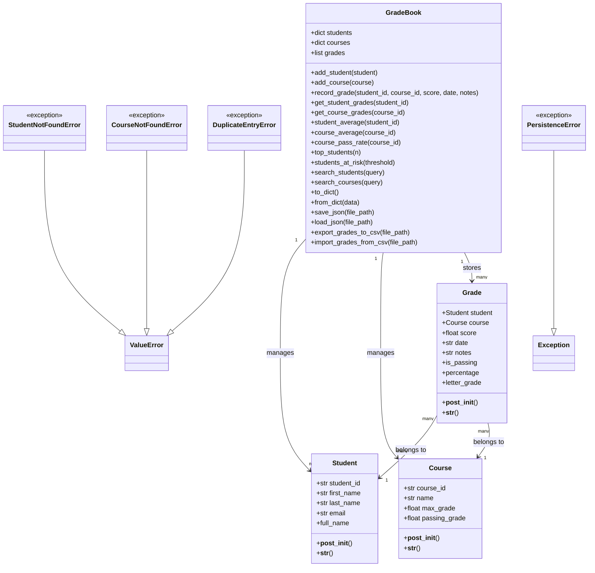

# Domain Model: Student Grade Tracker

This document describes the domain model of the Student Grade Tracker project.

The project manages students, courses, grades, statistics, JSON persistence,
and CSV import/export.

The central class is `GradeBook`.  
It stores all students, courses, and grades in one place.

---

## Main Idea

The most important idea of the project is:

```text
A Grade connects one Student with one Course.
The GradeBook manages all students, courses, and grades.
```

---

## Main Domain Classes

The project contains four main domain classes:

- `Student`
- `Course`
- `Grade`
- `GradeBook`

It also contains custom exception classes for special error situations.

---

## Student

A `Student` represents one learner in the grade tracker.

Each student has:

- `student_id`
- `first_name`
- `last_name`
- `email`

The student also has a calculated property:

- `full_name`

### Responsibility

The `Student` class is responsible for storing student information.

It also validates that important student data is not empty.

---

## Course

A `Course` represents one subject or course.

Each course has:

- `course_id`
- `name`
- `max_grade`
- `passing_grade`

### Responsibility

The `Course` class is responsible for storing course information.

It defines:

- the maximum possible grade
- the minimum grade needed to pass

---

## Grade

A `Grade` represents one recorded grade.

A grade belongs to:

- one student
- one course

Each grade has:

- `student`
- `course`
- `score`
- `date`
- `notes`

The grade also calculates:

- `is_passing`
- `percentage`
- `letter_grade`

### Responsibility

The `Grade` class connects a student with a course and stores the achieved score.

It also calculates whether the student passed and which letter grade belongs to the score.

---

## GradeBook

The `GradeBook` is the central management class of the project.

It stores:

- all students
- all courses
- all grades

### Responsibility

The `GradeBook` class is responsible for managing the complete grade system.

It can:

- add students
- add courses
- record grades
- get grades by student
- get grades by course
- calculate student averages
- calculate course averages
- calculate course pass rates
- find top students
- find students at risk
- search students
- search courses
- convert the grade book to dictionary data
- rebuild the grade book from dictionary data
- save data as JSON
- load data from JSON
- export grades to CSV
- import grades from CSV

---

## UML Class Diagram



---

## Relationships

### Student and Grade

One student can have many grades.

Example:

- Anna can have one grade in Computer Science.
- Anna can also have one grade in Data Structures.

Relationship:

```text
Student 1 --- many Grade
```

---

### Course and Grade

One course can have many grades.

Example:

- The course "Intro to Computer Science" can contain grades from many students.

Relationship:

```text
Course 1 --- many Grade
```

---

### Grade and Student

Each grade belongs to exactly one student.

Example:

```text
Grade: 85.0 points
Student: Anna Schmidt
```

Relationship:

```text
Grade many --- 1 Student
```

---

### Grade and Course

Each grade belongs to exactly one course.

Example:

```text
Grade: 85.0 points
Course: Intro to Computer Science
```

Relationship:

```text
Grade many --- 1 Course
```

---

### GradeBook and Domain Objects

The `GradeBook` manages the whole system.

It contains:

```text
GradeBook
├── students
├── courses
└── grades
```

The `GradeBook` is responsible for connecting students, courses, and grades.

---

## Business Rules

The project uses validation rules to keep the data clean.

---

### Student Rules

A student must follow these rules:

- The student ID must not be empty.
- The first name must not be empty.
- The last name must not be empty.
- The email address must contain `@`.

Example of valid student data:

```text
student_id: S001
first_name: Anna
last_name: Schmidt
email: anna@example.com
```

---

### Course Rules

A course must follow these rules:

- The course ID must not be empty.
- The course name must not be empty.
- The maximum grade must be greater than zero.
- The passing grade must be greater than zero.
- The passing grade must not be greater than the maximum grade.

Example of valid course data:

```text
course_id: CS101
name: Intro to Computer Science
max_grade: 100.0
passing_grade: 50.0
```

---

### Grade Rules

A grade must follow these rules:

- The score must not be below zero.
- The score must not be higher than the maximum grade of the course.
- The date must use ISO format.

Example of valid grade data:

```text
score: 85.0
date: 2026-07-07
```

---

### GradeBook Rules

The grade book must follow these rules:

- Duplicate student IDs are not allowed.
- Duplicate course IDs are not allowed.
- A grade can only be recorded for an existing student.
- A grade can only be recorded for an existing course.
- Average calculations require at least one recorded grade.

---

## Custom Exceptions

The project uses custom exceptions to make errors easier to understand.

### StudentNotFoundError

This error is raised when a student ID does not exist.

Example:

```text
Trying to record a grade for student S999,
but student S999 is not stored in the GradeBook.
```

---

### CourseNotFoundError

This error is raised when a course ID does not exist.

Example:

```text
Trying to record a grade for course CS999,
but course CS999 is not stored in the GradeBook.
```

---

### DuplicateEntryError

This error is raised when a student or course already exists.

Example:

```text
Trying to add student S001 twice.
```

---

### PersistenceError

This error is raised when saving or loading data fails.

Example:

```text
The JSON file cannot be read.
The CSV file cannot be imported.
The file content is invalid.
```

---

## Persistence

Persistence means that data can be saved and loaded again.

The project supports:

- JSON saving
- JSON loading
- CSV export
- CSV import

---

### JSON Persistence

JSON is used to save and load the complete grade book.

The `GradeBook` can be converted into dictionary data first.

Then the dictionary data can be saved as JSON.

Important methods:

- `to_dict()`
- `from_dict(data)`
- `save_json(file_path)`
- `load_json(file_path)`

---

### CSV Import and Export

CSV is used for grade data.

The project can export all grades into a CSV file.

It can also import grades from a CSV file.

Important methods:

- `export_grades_to_csv(file_path)`
- `import_grades_from_csv(file_path)`

CSV format:

```text
student_id,course_id,score,date
S001,CS101,85.0,2026-07-07
S002,CS101,45.0,2026-07-07
```

---

## Example Object Structure

This is an example of how the objects are connected:

```text
GradeBook
│
├── Student: Anna Schmidt
├── Student: Ben Mueller
│
├── Course: Intro to Computer Science
├── Course: Data Structures
│
└── Grade
    ├── Student: Anna Schmidt
    ├── Course: Intro to Computer Science
    └── Score: 85.0
```

---

## Responsibility Overview

| Class | Main Responsibility |
|---|---|
| `Student` | Stores student data |
| `Course` | Stores course data and grade limits |
| `Grade` | Connects one student with one course and stores a score |
| `GradeBook` | Manages students, courses, grades, statistics, and file operations |
| `StudentNotFoundError` | Shows that a student ID does not exist |
| `CourseNotFoundError` | Shows that a course ID does not exist |
| `DuplicateEntryError` | Shows that a student or course already exists |
| `PersistenceError` | Shows that saving or loading data failed |

---

## Short Summary

The domain model shows how the main parts of the project work together.

The central idea is:

```text
Student + Course = Grade
GradeBook manages everything.
```

A `Student` can have many grades.  
A `Course` can have many grades.  
Each `Grade` belongs to one student and one course.  
The `GradeBook` stores and manages all objects.