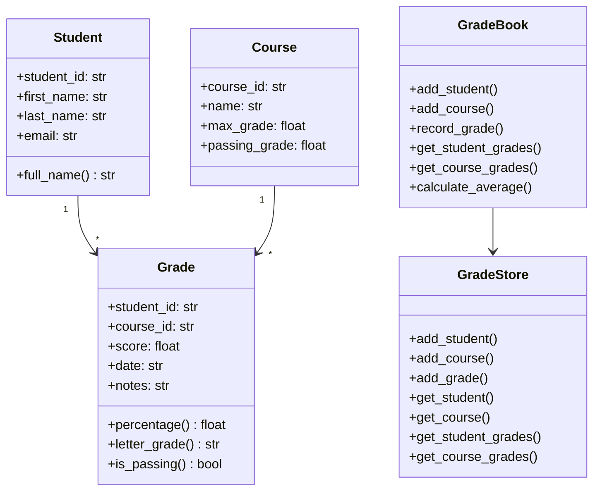
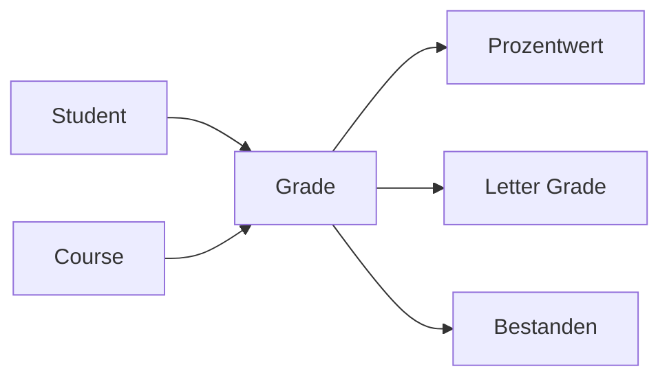
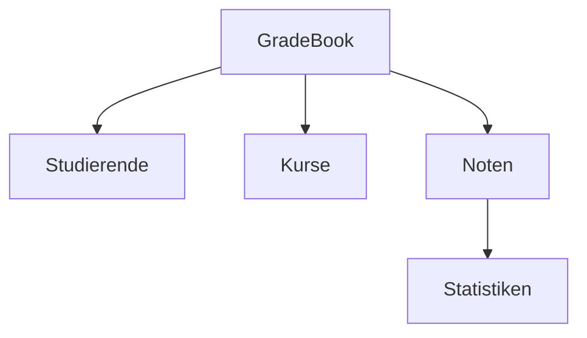
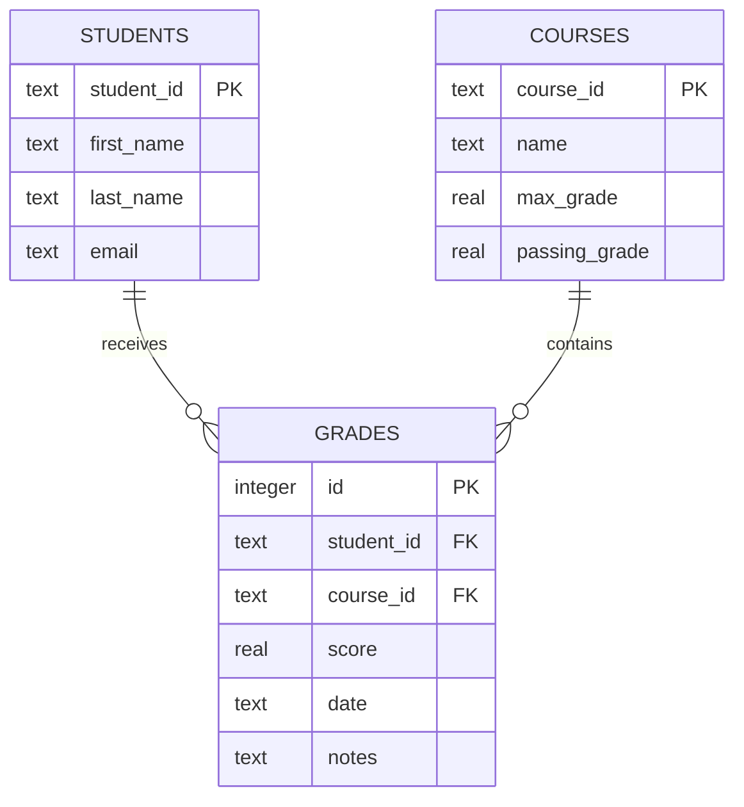
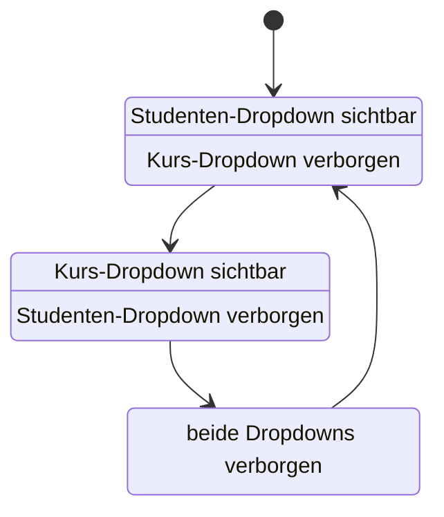
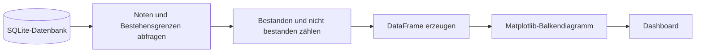
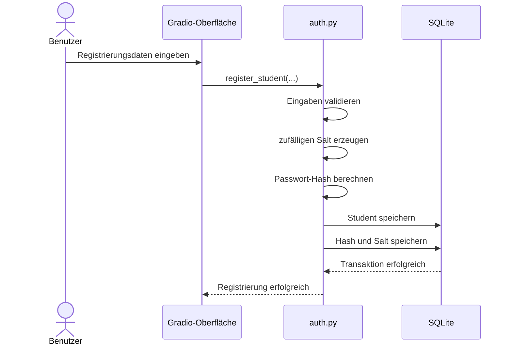
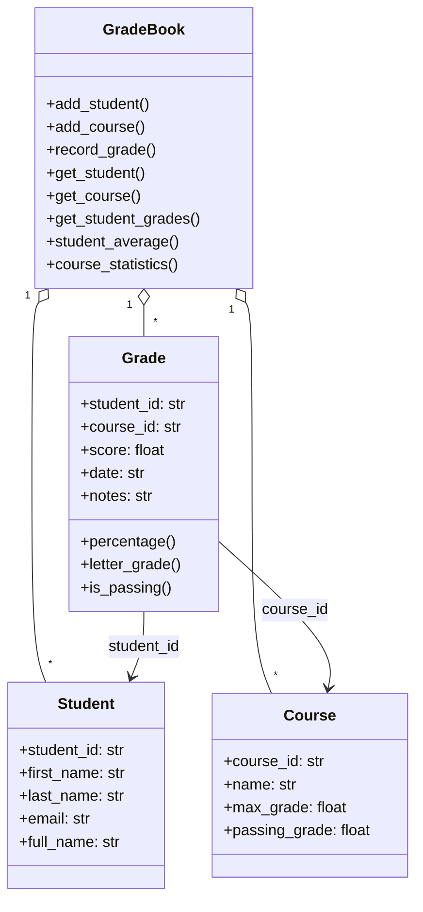

# Projektbeschreibung – Student Grade Tracker

## 1. Überblick

Der **Student Grade Tracker** ist eine in Python entwickelte Anwendung zur Verwaltung und Auswertung von Studierenden, Kursen und Noten.

Die Anwendung verbindet eine objektorientierte Programmlogik mit einer SQLite-Datenbank und einer browserbasierten Benutzeroberfläche auf Basis von Gradio. Neben klassischen Verwaltungsfunktionen stehen Berichte, Dashboard-Kennzahlen, Diagramme und CSV-Exporte zur Verfügung.

Das Projekt wurde schrittweise in mehreren Entwicklungsphasen umgesetzt. Jede Phase erweitert die vorherige um zusätzliche technische und fachliche Funktionen.

---

## 2. Projektziele

Das Projekt verfolgt folgende Ziele:

- objektorientierte Modellierung einer Notenverwaltung
- strukturierte Speicherung in einer SQLite-Datenbank
- Trennung von Fachlogik, Persistenz und Benutzeroberfläche
- automatisierte Berechnung von Durchschnitt und Bestehensstatus
- Erstellung unterschiedlicher Berichte
- übersichtliche Darstellung wichtiger Kennzahlen
- CSV-Export ausgewählter Datenbanktabellen
- Registrierung und Anmeldung von Studierenden
- automatisierte Tests zur Qualitätssicherung
- nachvollziehbare Versionsverwaltung mit Git und GitHub

---

## 3. Hauptfunktionen

### Verwaltung von Studierenden

Studierende werden mit folgenden Eigenschaften verwaltet:

- Student-ID
- Vorname
- Nachname
- E-Mail-Adresse

Zusätzlich können neue Studierende über die Gradio-Oberfläche registriert werden.

### Verwaltung von Kursen

Kurse besitzen:

- Kurs-ID
- Kursname
- maximale Punktzahl
- Bestehensgrenze

### Verwaltung von Noten

Eine Note verbindet einen Studierenden mit einem Kurs. Gespeichert werden:

- Student-ID
- Kurs-ID
- erreichte Punktzahl
- Datum
- optionale Bemerkung

### Berichte

Die Anwendung erzeugt:

- Student Report
- Course Report
- Summary Report

Die passenden Auswahlfelder werden abhängig vom ausgewählten Reporttyp angezeigt.

### Dashboard

Das Dashboard liest seine Kennzahlen direkt aus SQLite:

- Anzahl der Studierenden
- Anzahl der Kurse
- Anzahl der erfassten Noten
- Gesamtdurchschnitt
- Bestehensquote

Zusätzlich zeigt ein Balkendiagramm die Anzahl bestandener und nicht bestandener Noten.

### SQLite-Ansicht und CSV-Export

Die Tabellen `students`, `courses` und `grades` können in der Oberfläche angezeigt und als CSV-Dateien exportiert werden.

### Studentenzugang

Die Anwendung enthält eine einfache Registrierung und Anmeldung. Passwörter werden nicht im Klartext gespeichert, sondern als Hashwerte in SQLite abgelegt.

---

## 4. Technische Architektur

Die Anwendung verwendet eine mehrschichtige Struktur:

```text
Gradio-Benutzeroberfläche
          │
          ▼
Anwendungs- und Reportlogik
          │
          ▼
GradeBook und GradeStore
          │
          ▼
SQLite-Datenbank
```

### Zentrale Module

| Modul | Aufgabe |
|---|---|
| `student.py` | Modell eines Studierenden |
| `course.py` | Modell eines Kurses |
| `grade.py` | Modell und Auswertung einer Note |
| `gradebook.py` | zentrale Fachlogik |
| `grade_store.py` | Speicherabstraktion und CRUD-Funktionen |
| `database.py` | Aufbau und Initialisierung von SQLite |
| `reports/` | Text- und CSV-Berichte |
| `auth.py` | Registrierung, Passwort-Hashing und Anmeldung |
| `app.py` | Gradio-Oberfläche und Benutzerinteraktion |
| `exceptions.py` | projektspezifische Ausnahmen |

### Vereinfachtes Klassendiagramm



---

## 5. Entwicklungsphasen

### Phase 1 – Domänenmodell und Grundlagen

In der ersten Phase wurden die zentralen Klassen entwickelt:

- `Student`
- `Course`
- `Grade`

Der Schwerpunkt lag auf objektorientierter Modellierung, Validierung und grundlegenden Berechnungen.



### Phase 2 – GradeBook und zentrale Fachlogik

Die Klasse `GradeBook` bündelt die fachlichen Funktionen:

- Studierende hinzufügen
- Kurse hinzufügen
- Noten erfassen
- Noten suchen
- Durchschnittswerte berechnen
- Bestehensquoten ermitteln



### Phase 3 – Persistenz und SQLite

In dieser Phase wurde die dauerhafte Speicherung ergänzt.

Die SQLite-Datenbank enthält die Tabellen:

- `students`
- `courses`
- `grades`

Die Beziehungen werden durch Fremdschlüssel abgebildet.



## Phase 4 – SQLite-Persistenz

Die bisherige dateibasierte Speicherung wurde durch eine relationale SQLite-Datenbank ergänzt. Studierende, Kurse und Noten werden in getrennten Tabellen gespeichert.

Fremdschlüssel bilden die fachlichen Beziehungen ab:

* Eine Note gehört zu genau einem Studierenden.
* Eine Note gehört zu genau einem Kurs.
* Ein Studierender kann mehrere Noten besitzen.
* Ein Kurs kann mehrere Noten enthalten.

Die Anwendung verwendet die lokale Datenbankdatei `grade_tracker.db`. Die Datenbank selbst wird nicht im Repository versioniert, da sie lokale Anwendungs- und Zugangsdaten enthalten kann.

```mermaid
erDiagram
    STUDENTS ||--o{ GRADES : receives
    COURSES ||--o{ GRADES : contains
    STUDENTS ||--o| STUDENT_ACCOUNTS : owns

    STUDENTS {
        text student_id PK
        text first_name
        text last_name
        text email
    }

    COURSES {
        text course_id PK
        text name
        real max_grade
        real passing_grade
    }

    GRADES {
        integer id PK
        text student_id FK
        text course_id FK
        real score
        text date
        text notes
    }

    STUDENT_ACCOUNTS {
        text student_id PK_FK
        text password_hash
        text salt
    }
```

Zusätzlich bietet die Gradio-Oberfläche einen SQLite-Tab. Dort können die freigegebenen Tabellen `students`, `courses` und `grades` angezeigt werden.

Eine Whitelist verhindert, dass beliebige Tabellennamen an eine SQL-Abfrage übergeben werden.

**Ergebnis:** Die Anwendung verfügt über eine dauerhafte relationale Datenspeicherung mit nachvollziehbaren Beziehungen zwischen Studierenden, Kursen und Noten.

---

## Phase 5 – Reports und Gradio-Oberfläche

In Phase 5 wurde die Kernanwendung um eine grafische Benutzeroberfläche mit Gradio erweitert.

Die Oberfläche enthält mehrere Bereiche:

* Dashboard
* Studentenzugang
* SQLite-Datenbank
* Reports

Der Reportbereich stellt drei Berichtsarten bereit:

### Student Report

Der Student Report zeigt:

* Name des Studierenden
* Student-ID
* E-Mail-Adresse
* belegte beziehungsweise bewertete Kurse
* erreichte Punktzahl
* prozentuales Ergebnis
* Buchstabennote
* Bestehensstatus
* persönlichen Durchschnitt

### Course Report

Der Course Report zeigt:

* Kursname
* Kurs-ID
* vorhandene Noten
* zugehörige Studierende
* Kursdurchschnitt
* Bestehensquote

### Summary Report

Der Summary Report fasst das gesamte Notenbuch zusammen:

* Anzahl der Studierenden
* Anzahl der Kurse
* Anzahl der Noten
* Kursstatistiken
* Durchschnittswerte
* Bestehensquoten

Für Student Reports und Course Reports wurden getrennte Dropdown-Menüs erstellt. Dadurch muss der Benutzer keine IDs manuell eingeben.

Die Oberfläche reagiert dynamisch auf den ausgewählten Reporttyp:



Neu registrierte Studierende werden aus der SQLite-Datenbank geladen und nach dem Aktualisieren beziehungsweise Neustarten der Anwendung in der Auswahl angezeigt.

**Ergebnis:** Berichte können über eine verständliche grafische Oberfläche ausgewählt und erzeugt werden.

---

## Phase 6 – Dashboard, Export und Benutzerzugang

Phase 6 erweitert die Anwendung um Funktionen, die über die reine Notenverwaltung hinausgehen.

### Dashboard

Das Dashboard liest seine Kennzahlen direkt aus der SQLite-Datenbank.

Angezeigt werden:

* Anzahl der Studierenden
* Anzahl der Kurse
* Anzahl der erfassten Noten
* Gesamtdurchschnitt
* Bestehensquote

Dadurch entsprechen die angezeigten Werte dem aktuellen Datenbestand und nicht mehr fest eingetragenen Demo-Werten.

### Bestehensdiagramm

Die Anwendung erzeugt mit Matplotlib ein Balkendiagramm. Es stellt bestandene und nicht bestandene Noten gegenüber.



Das Diagramm wird automatisch aus den in SQLite gespeicherten Noten berechnet.

### CSV-Export

Im SQLite-Tab kann die ausgewählte Tabelle als CSV-Datei exportiert werden.

Der Ablauf ist:

1. Tabelle auswählen.
2. Tabelleninhalt laden.
3. „Als CSV exportieren“ anklicken.
4. Erzeugte Datei herunterladen.

Auch beim Export dürfen ausschließlich freigegebene Tabellen verwendet werden.

### Studentenregistrierung und Anmeldung

Der Tab „Zugang“ enthält zwei Bereiche:

* Anmeldung eines vorhandenen Studierenden
* Registrierung eines neuen Studierenden

Bei der Registrierung werden folgende Angaben erfasst:

* Student-ID
* Vorname
* Nachname
* E-Mail-Adresse
* Passwort
* Passwortwiederholung

Das Passwort wird nicht im Klartext gespeichert. Stattdessen wird ein zufälliger Salt erzeugt und gemeinsam mit dem Passwort zur Berechnung eines Passwort-Hashs verwendet.



Bei der Anmeldung wird das eingegebene Passwort mit dem gespeicherten Salt erneut gehasht. Anschließend wird der berechnete Hash mit dem gespeicherten Wert verglichen.

**Ergebnis:** Die Anwendung besitzt ein datenbankgestütztes Dashboard, einen CSV-Export und eine grundlegende sichere Studentenregistrierung.

---

# Domain Model

Das Domain Model beschreibt die fachlichen Kernobjekte der Anwendung. Es ist unabhängig von Gradio und SQLite aufgebaut.



## Verantwortlichkeiten der Klassen

### Student

Die Klasse `Student` repräsentiert einen Studierenden. Sie speichert die Student-ID, den Vor- und Nachnamen sowie die E-Mail-Adresse.

### Course

Die Klasse `Course` repräsentiert einen Kurs. Neben Kurs-ID und Kursname enthält sie die maximale Punktzahl und die erforderliche Bestehensgrenze.

### Grade

Die Klasse `Grade` verbindet einen Studierenden mit einem Kurs und einem erreichten Ergebnis. Sie berechnet:

* prozentuales Ergebnis
* Buchstabennote
* Bestehensstatus

### GradeBook

`GradeBook` dient als zentrale fachliche Verwaltung. Es koordiniert Studierende, Kurse und Noten und stellt Such- und Statistikfunktionen bereit.

**Architekturentscheidung:** Fachliche Berechnungen gehören in das Domain Model. Die Benutzeroberfläche soll diese Funktionen lediglich aufrufen und Ergebnisse darstellen.

---

# Tests und Qualitätssicherung

Die Anwendung besitzt automatisierte Tests für:

* Studierende
* Kurse
* Noten
* GradeBook
* Validierung
* Exceptions
* Datenbankoperationen
* Persistenz
* Reports
* Integrationsabläufe

Die Tests werden mit folgendem Befehl ausgeführt:

```bash
uv run pytest -q
```

Der zuletzt dokumentierte Testlauf ergab:

```text
100 passed
```

Die Tests prüfen sowohl reguläre Abläufe als auch Fehlerfälle, beispielsweise:

* doppelte Student-IDs
* unbekannte Studierende
* unbekannte Kurse
* ungültige Punktzahlen
* beschädigte oder unvollständige Daten
* leere Pflichtfelder

---

# Bekannte Grenzen

Die Anwendung ist ein Lern- und Demonstrationsprojekt. Folgende Punkte können zukünftig verbessert werden:

* automatische Aktualisierung der Dropdowns ohne App-Neustart
* vollständige Sitzungsverwaltung nach der Anmeldung
* Rollen und Berechtigungen für Studierende und Lehrkräfte
* Zurücksetzen vergessener Passwörter
* Änderungs- und Löschfunktionen in der Oberfläche
* stärkere Trennung zwischen UI, Anwendungslogik und Datenbankzugriffen
* zusätzliche Diagramme und Filter
* Deployment auf einem Server
* umfassendere Tests für Authentifizierung und Gradio-Ereignisse

---

# Fazit

Der Student Grade Tracker entwickelte sich schrittweise von einem objektorientierten Konsolenprojekt zu einer grafischen, datenbankgestützten Anwendung.

Das Projekt demonstriert:

* objektorientierte Modellierung
* Validierung und Fehlerbehandlung
* Datei- und SQLite-Persistenz
* automatisierte Tests
* Reportgenerierung
* grafische Oberflächenentwicklung mit Gradio
* Datenvisualisierung mit Matplotlib
* CSV-Export
* sichere Passwortspeicherung durch Salt und Hash
* strukturierte, phasenweise Softwareentwicklung

Die Kernfunktionalität ist umgesetzt. Weitere Arbeiten betreffen hauptsächlich Feinschliff, zusätzliche Tests, Dokumentation und mögliche Komfortfunktionen.


# Project Description: Student Grade Tracker

## Overview

The Student Grade Tracker is a Python project for managing students, courses, grades, and grade statistics.

The goal of the project is to create a simple, structured, and understandable grade management system. The system can store students, store courses, record grades, calculate averages, calculate pass rates, search data, and save or load information from files.

The project is written in Python and uses object-oriented programming. The main idea is to separate the responsibilities into different classes. Each class has a clear task inside the application.

---

## Project Goal

The goal of this project is to build a clean and understandable student grade management system.

The application should be able to manage students, manage courses, record grades, calculate student averages, calculate course averages, calculate course pass rates, find top students, find students at risk, search for students and courses, save the grade book as JSON, load the grade book from JSON, export grades to CSV, import grades from CSV, handle errors with custom exceptions, and verify the behavior with automated tests.

The project also focuses on clean code structure, readable names, validation, docstrings, and tests.

---

## Graphical User Interface

The project includes a graphical user interface created with Gradio.

The user interface is divided into four main tabs:

- Dashboard
- Welcome
- SQLite Database
- Reports

The Gradio interface connects the existing Python domain logic with a
browser-based user interface. This allows users to work with the application
without entering Python commands manually.

---

## Dashboard

The dashboard displays important statistics from the SQLite database.

It shows:

- the number of students
- the number of courses
- the number of recorded grades
- the overall grade average
- the overall pass rate

The dashboard values are calculated dynamically. They are not stored as fixed
text values.

The application reads the current data from the SQLite tables and calculates
the displayed statistics when the application starts.

The dashboard also contains a bar chart that compares:

- passed grades
- failed grades

The chart uses the passing grade defined for each course.

---

## SQLite Database

The project uses SQLite for persistent data storage.

The database contains three main tables:

- `students`
- `courses`
- `grades`

The `grades` table connects students and courses through foreign keys.

The Gradio interface includes a database viewer. The user can select one of
the permitted tables and display its current content.

Only explicitly permitted table names can be used. This provides a simple
safety mechanism for the dynamically created SQL query.

---

## CSV Export

The tables `students`, `courses`, and `grades` can be exported as CSV files
through the Gradio interface.

The user selects a table and clicks the CSV export button. The application
then:

1. reads the selected table from SQLite,
2. creates a pandas DataFrame,
3. writes the data to a UTF-8 encoded CSV file,
4. provides the file for download through Gradio.

The CSV files are created inside the local `exports` directory.

---

## Text Reports

The application provides three report types:

- Student Report
- Course Report
- Summary Report

The Student Report displays information and grades for one selected student.

The Course Report displays all grades and statistics for one selected course.

The Summary Report displays an overview of the complete grade book.

Students and courses are selected through separate dropdown menus.

The visible input field changes dynamically:

- Student Report shows only the student dropdown.
- Course Report shows only the course dropdown.
- Summary Report hides both dropdowns.

A small selection function decides which identifier is passed to the report
generator.

---

## Error Handling

The Gradio functions use the existing custom exceptions from the domain
logic.

For example:

- an unknown student ID produces a clear student error message,
- an unknown course ID produces a clear course error message,
- an invalid table cannot be displayed or exported,
- a missing database produces a clear database message.

This keeps technical errors away from the user interface and provides
understandable feedback.

---

## Automated Tests

The project is verified with pytest.

The automated test suite covers:

- students
- courses
- grades
- grade book calculations
- custom exceptions
- persistence
- SQLite database operations
- reports
- integration behavior

Current test result:

```text
100 tests passed
## Main Idea

The most important idea of the project is that a grade connects one student with one course.

A student can have many grades. A course can have many grades. Each grade belongs to one student and one course.

The GradeBook is the central class of the project. It manages all students, all courses, and all recorded grades.

In simple words:

```text
Student + Course + Score = Grade
GradeBook manages everything.
```

---

## Project Structure

The project is organized into separate files and folders.

Example structure:

```text
student_grade_tracker/
│
├── notenverwaltung/
│   ├── __init__.py
│   ├── student.py
│   ├── course.py
│   ├── grade.py
│   ├── gradebook.py
│   └── exceptions.py
│
├── tests/
│   ├── __init__.py
│   ├── test_setup.py
│   ├── test_student.py
│   ├── test_course.py
│   ├── test_grade.py
│   ├── test_gradebook.py
│   ├── test_exceptions.py
│   └── test_persistence.py
│
├── docs/
│   ├── domain_model.md
│   └── projektbeschreibung.md
│
└── README.md
```

The `notenverwaltung` folder contains the actual application code.

The `tests` folder contains the automated tests.

The `docs` folder contains project documentation, such as the domain model and the project description.

---

## Main Classes

The project contains four main domain classes:

- `Student`
- `Course`
- `Grade`
- `GradeBook`

It also contains custom exception classes for special error situations.

---

## Student Class

The `Student` class represents one student in the grade tracker.

A student has a student ID, a first name, a last name, and an email address.

The class also provides a `full_name` property. This property combines the first name and the last name into one readable full name.

The responsibility of the `Student` class is to store student information and validate basic student data.

Important validation rules:

- The student ID must not be empty.
- The first name must not be empty.
- The last name must not be empty.
- The email address must contain `@`.

Example:

```text
student_id: S001
first_name: Anna
last_name: Schmidt
email: anna@example.com
```

---

## Course Class

The `Course` class represents one subject or course.

A course has a course ID, a course name, a maximum possible grade, and a passing grade.

The responsibility of the `Course` class is to store course information and define the grade limits for that course.

Important validation rules:

- The course ID must not be empty.
- The course name must not be empty.
- The maximum grade must be greater than zero.
- The passing grade must be greater than zero.
- The passing grade must not be greater than the maximum grade.

Example:

```text
course_id: CS101
name: Intro to Computer Science
max_grade: 100.0
passing_grade: 50.0
```

---

## Grade Class

The `Grade` class represents one recorded grade.

A grade connects one student with one course. It also stores the achieved score, the date, and optional notes.

The class provides calculated properties:

- `is_passing`
- `percentage`
- `letter_grade`

The responsibility of the `Grade` class is to store one grade and calculate useful information from it.

Important validation rules:

- The score must not be below zero.
- The score must not be higher than the maximum grade of the course.
- The date must use ISO format.

Example:

```text
student: Anna Schmidt
course: Intro to Computer Science
score: 85.0
date: 2026-07-07
```

---

## GradeBook Class

The `GradeBook` class is the central management class of the project.

It stores all students, all courses, and all grades.

The `GradeBook` is responsible for connecting the other classes and providing the main functionality of the application.

The class can add students, add courses, record grades, get grades by student, get grades by course, calculate averages, calculate pass rates, find top students, find students at risk, search students, search courses, save data as JSON, load data from JSON, export grades to CSV, and import grades from CSV.

The `GradeBook` therefore works like the central control unit of the whole application.

---

## Custom Exceptions

The project uses custom exceptions to make error messages clearer.

The custom exceptions are:

- `StudentNotFoundError`
- `CourseNotFoundError`
- `DuplicateEntryError`
- `PersistenceError`

These custom exceptions make the program easier to understand because each error has a clear meaning.

For example:

```text
StudentNotFoundError means that a student ID does not exist.
CourseNotFoundError means that a course ID does not exist.
DuplicateEntryError means that a student or course already exists.
PersistenceError means that saving or loading data failed.
```

The first three custom exceptions inherit from `ValueError`. This keeps older tests with `pytest.raises(ValueError)` valid while still making the error types more specific.

---

## Persistence

Persistence means that data can be saved and loaded again.

This project supports three forms of persistence and data exchange:

- JSON
- CSV
- SQLite

JSON is used to save and load the complete grade book.

CSV is used to import, export, and exchange tabular grade data.

SQLite is used as the persistent relational database for students, courses,
and grades. It also supplies the data displayed in the dashboard and database
viewer.

---

## JSON Saving and Loading

JSON is used to save and load the complete `GradeBook`.

The `GradeBook` can be converted into simple dictionary data. This dictionary data can then be saved as JSON.

Important methods:

- `to_dict()`
- `from_dict(data)`
- `save_json(file_path)`
- `load_json(file_path)`

JSON is useful because it can store the complete structure of the grade book.

It can store:

- students
- courses
- grades

This makes it possible to save the current state of the application and load it again later.

---

## CSV Export and Import

CSV is used for grade data.

The project can export all recorded grades into a CSV file.

Example CSV format:

```text
student_id,course_id,score,date
S001,CS101,85.0,2026-07-07
S002,CS101,45.0,2026-07-07
```

The project can also import grades from a CSV file.

During import, valid lines are imported and invalid lines are skipped. The import method returns a report that shows how many lines were imported, how many lines were skipped, and which errors occurred.

This makes the CSV import safer and easier to check.

---

## Search Functions

The project includes search functions for students and courses.

Students can be searched by first name, last name, email, or full name.

Courses can be searched by course name.

The search uses regular expressions and is case-insensitive. This means that uppercase and lowercase letters do not matter.

Example:

```text
Searching for "anna" can find "Anna Schmidt".
Searching for "data" can find "Data Structures".
```

---

## Statistics

The project can calculate different statistics.

The `GradeBook` can calculate the average percentage of one student, the average score of one course, the pass rate of one course, the top students, and students below a risk threshold.

These statistics help to understand the performance of students and courses.

Examples:

```text
Student average: Shows the average result of one student.
Course average: Shows the average score in one course.
Course pass rate: Shows how many students passed a course.
Top students: Shows the students with the best averages.
Students at risk: Shows students below a defined threshold.
```

---

## Testing

The project uses `pytest` for automated testing.

The tests check whether the application behaves correctly.

The test files cover student creation and validation, course creation and validation, grade creation and validation, grade calculations, grade book management, duplicate entries, unknown students, unknown courses, JSON saving and loading, CSV export and import, custom exceptions, and basic project setup.

Automated tests are important because they make the project more reliable.

If a future change breaks existing behavior, pytest can detect the problem.

---

## Example Workflow

A typical workflow in the project looks like this:

```text
1. Create a GradeBook.
2. Add students.
3. Add courses.
4. Record grades.
5. Calculate averages and pass rates.
6. Search for students or courses.
7. Save the GradeBook as JSON.
8. Export grades as CSV.
```

Example:

```text
Student: Anna Schmidt
Course: Intro to Computer Science
Score: 85.0
Date: 2026-07-07
Result: Passed
```

---

## Technologies Used

The project uses:

- Python
- dataclasses
- pytest
- JSON
- CSV
- regular expressions
- pathlib
- custom exceptions
- object-oriented programming

---

## Object-Oriented Programming

The project uses object-oriented programming to keep the code organized.

Each class has a clear responsibility.

| Class | Responsibility |
|---|---|
| `Student` | Stores student data |
| `Course` | Stores course data and grade limits |
| `Grade` | Connects one student with one course and stores a score |
| `GradeBook` | Manages students, courses, grades, statistics, and file operations |
| `StudentNotFoundError` | Represents a missing student |
| `CourseNotFoundError` | Represents a missing course |
| `DuplicateEntryError` | Represents duplicate students or courses |
| `PersistenceError` | Represents saving or loading problems |

This structure makes the project easier to read, test, and extend.

---

## Validation

Validation is an important part of the project.

The project checks data early to avoid invalid objects.

Examples:

```text
A student cannot have an empty student ID.
A course cannot have a passing grade above the maximum grade.
A grade cannot have a score higher than the course maximum grade.
A grade date must use ISO format.
```

This makes the project safer and reduces unexpected errors.

---

## Error Handling

The project uses exceptions to handle error situations.

Examples of error situations are adding the same student twice, adding the same course twice, recording a grade for an unknown student, recording a grade for an unknown course, loading a missing JSON file, loading invalid JSON data, or importing a missing CSV file.

Instead of silently ignoring these problems, the project raises clear errors.

This makes debugging easier.

---

## Why This Project Is Useful

The Student Grade Tracker is useful because it combines several important programming concepts in one project.

It includes classes, objects, dataclasses, properties, validation, lists, dictionaries, file handling, JSON, CSV, exceptions, and tests.

The project is small enough to understand, but large enough to practice real software structure.

It shows how different parts of a program can work together in a clean and organized way.

---

## Possible Future Improvements

The project could be extended in the future.

Possible improvements:

- add a command-line interface
- add a graphical user interface
- add more detailed email validation
- support more CSV columns
- add grade categories
- add weighted averages
- add student groups
- add course descriptions
- add more detailed reports
- save and load notes in CSV
- improve date handling
- add more tests for edge cases

These improvements are not required for the current version, but they show how the project could grow.

---

## Short Summary

The Student Grade Tracker is a Python project for managing students, courses, and grades.

The main class is `GradeBook`.

The main idea is:

```text
A Grade connects one Student with one Course.
The GradeBook manages the complete system.
```

The project demonstrates object-oriented programming, validation, custom exceptions, JSON persistence, CSV import/export, and automated testing with pytest.